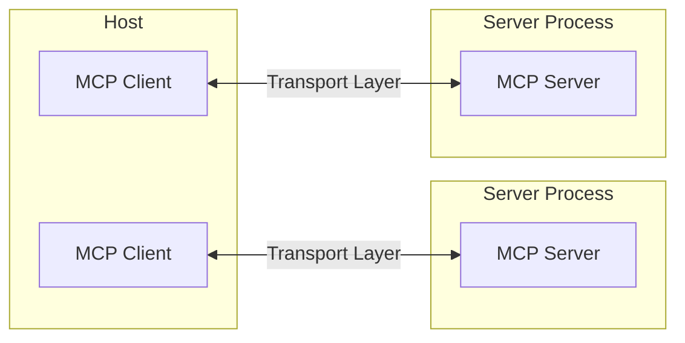
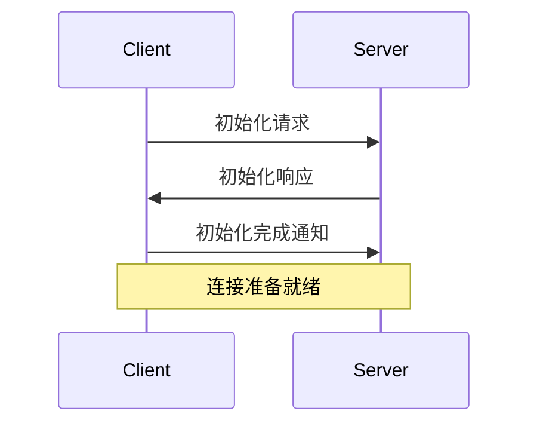

模型上下文协议（Model Context Protocol，MCP）基于灵活且可扩展的架构构建，可实现 LLM 应用和集成之间的无缝通信。本文件涵盖核心架构组件和概念。

## 概述

MCP 遵循客户端-服务器架构，其中：

- **Hosts** 是 LLM 应用（例如 Claude Desktop 或 IDE），负责建立连接。
- **Clients** 在 host 应用程序内部与服务器建立 1:1 连接。
- **Servers** 为客户端提供上下文、工具和提示。



## 核心组件

### 协议层

协议层负责消息框架、请求/响应链接以及高级通信模式。


{}

```typescript
class Protocol<Request, Notification, Result> {
    // 处理传入的请求
    setRequestHandler<T>(schema: T, handler: (request: T, extra: RequestHandlerExtra) => Promise<Result>): void

    // 处理传入的通知
    setNotificationHandler<T>(schema: T, handler: (notification: T) => Promise<void>): void

    // 发送请求并等待响应
    request<T>(request: Request, schema: T, options?: RequestOptions): Promise<T>

    // 发送单向通知
    notification(notification: Notification): Promise<void>
}
```

{}
{}


```python
class Session(BaseSession[RequestT, NotificationT, ResultT]):
    async def send_request(
        self,
        request: RequestT,
        result_type: type[Result]
    ) -> Result:
        """
        发送请求并等待响应。如果响应包含错误，则抛出 McpError。
        """
        # 请求处理实现

    async def send_notification(
        self,
        notification: NotificationT
    ) -> None:
        """发送单向通知，不期望响应。"""
        # 通知处理实现

    async def _received_request(
        self,
        responder: RequestResponder[ReceiveRequestT, ResultT]
    ) -> None:
        """处理来自另一侧的传入请求。"""
        # 请求处理实现

    async def _received_notification(
        self,
        notification: ReceiveNotificationT
    ) -> None:
        """处理来自另一侧的传入通知。"""
        # 通知处理实现
```

{}


主要类包括：

- `Protocol`
- `Client`
- `Server`

### 传输层

传输层负责客户端与服务器之间的实际通信。MCP 支持多种传输机制：

1. **Stdio 传输**
   - 使用标准输入/输出进行通信
   - 适用于本地进程

2. **HTTP 与 SSE 传输**
   - 使用 Server-Sent Events（服务器推送事件）进行服务器到客户端的消息传递
   - 使用 HTTP POST 进行客户端到服务器的消息传递

所有传输均使用 [JSON-RPC](https://www.jsonrpc.org/) 2.0 来交换消息。详细信息请参阅 [规范](https://spec.modelcontextprotocol.io)。

### 消息类型

MCP 主要有以下几类消息：

1. **Requests** 期望对方提供响应：

    ```typescript
    interface Request {
      method: string;
      params?: { ... };
    }
    ```

2. **Results** 是对请求的成功响应：

    ```typescript
    interface Result {
      [key: string]: unknown;
    }
    ```

3. **Errors** 表示请求失败：

    ```typescript
    interface Error {
      code: number;
      message: string;
      data?: unknown;
    }
    ```

4. **Notifications** 属于不需要响应的单向消息：

    ```typescript
    interface Notification {
      method: string;
      params?: { ... };
    }
    ```

## 连接生命周期

### 1. 初始化



1. 客户端发送 `initialize` 请求，包括协议版本和功能。
2. 服务器响应其协议版本和功能。
3. 客户端发送 `initialized` 通知以表示确认。
4. 开始正常的消息交换。

### 2. 消息交换

初始化后，支持以下模式：

- **请求-响应**：客户端或服务器发送请求，另一端响应。
- **通知**：任意一方发送单向消息。

### 3. 终止

双方均可终止连接：

- 通过 `close()` 进行干净关闭。
- 传输层断开连接。
- 错误情况。

## 错误处理

MCP 定义了以下标准错误代码：

```typescript
enum ErrorCode {
  // JSON-RPC 标准错误代码
  ParseError = -32700,
  InvalidRequest = -32600,
  MethodNotFound = -32601,
  InvalidParams = -32602,
  InternalError = -32603
}
```

SDK 和应用程序可以定义大于 -32000 的自定义错误代码。

错误通过以下方式传播：

- 请求的错误响应。
- 传输层的错误事件。
- 协议层的错误处理程序。

## 实现示例

以下是实现 MCP 服务器的基础示例：



{}

```typescript
import { Server } from "@modelcontextprotocol/sdk/server/index.js";
import { StdioServerTransport } from "@modelcontextprotocol/sdk/server/stdio.js";

const server = new Server({
  name: "example-server",
  version: "1.0.0"
}, {
  capabilities: {
    resources: {}
  }
});

// 处理请求
server.setRequestHandler(ListResourcesRequestSchema, async () => {
  return {
    resources: [
      {
        uri: "example://resource",
        name: "示例资源"
      }
    ]
  };
});

// 连接传输
const transport = new StdioServerTransport();
await server.connect(transport);
```

{}
{}

```python
import asyncio
import mcp.types as types
from mcp.server import Server
from mcp.server.stdio import stdio_server

app = Server("example-server")

@app.list_resources()
async def list_resources() -> list[types.Resource]:
    return [
        types.Resource(
            uri="example://resource",
            name="示例资源"
        )
    ]

async def main():
    async with stdio_server() as streams:
        await app.run(
            streams[0],
            streams[1],
            app.create_initialization_options()
        )

if __name__ == "__main__":
    asyncio.run(main)
```

{}



## 最佳实践

### 传输选择

1. **本地通信**
   - 对于本地进程，使用 stdio 传输。
   - 高效的同机通信。
   - 简单的进程管理。

2. **远程通信**
   - 如果需要 HTTP 兼容性，使用 SSE。
   - 考虑包括身份验证和授权的安全影响。

### 消息处理

1. **请求处理**
   - 彻底验证输入。
   - 使用类型安全的模式。
   - 优雅的错误处理。
   - 实现超时时间。

2. **进度报告**
   - 对于长时间操作，使用进度标识符。
   - 增量式报告进度。
   - 如果已知总进度，包含总进度。

3. **错误管理**
   - 使用适当的错误代码。
   - 提供有帮助的错误信息。
   - 发生错误时清理资源。

## 安全考量

1. **传输安全**
   - 对远程连接使用 TLS。
   - 验证连接来源。
   - 在必要时实现身份验证。

2. **消息验证**
   - 验证所有传入消息。
   - 清理输入。
   - 检查消息大小限制。
   - 验证 JSON-RPC 格式。

3. **资源保护**
   - 实施访问控制。
   - 验证资源路径。
   - 监控资源使用情况。
   - 限制请求频率。

4. **错误处理**
   - 防止泄露敏感信息。
   - 记录与安全相关的错误。
   - 实施适当的清理。
   - 处理 DoS 情况。

## 调试与监控

1. **日志记录**
   - 记录协议事件。
   - 追踪消息流。
   - 监控性能。
   - 记录错误。

2. **诊断**
   - 实现健康检查。
   - 监控连接状态。
   - 跟踪资源使用情况。
   - 性能分析。

3. **测试**
   - 测试不同的传输方法。
   - 验证错误处理。
   - 检查边界情况。
   - 负载测试服务器。
