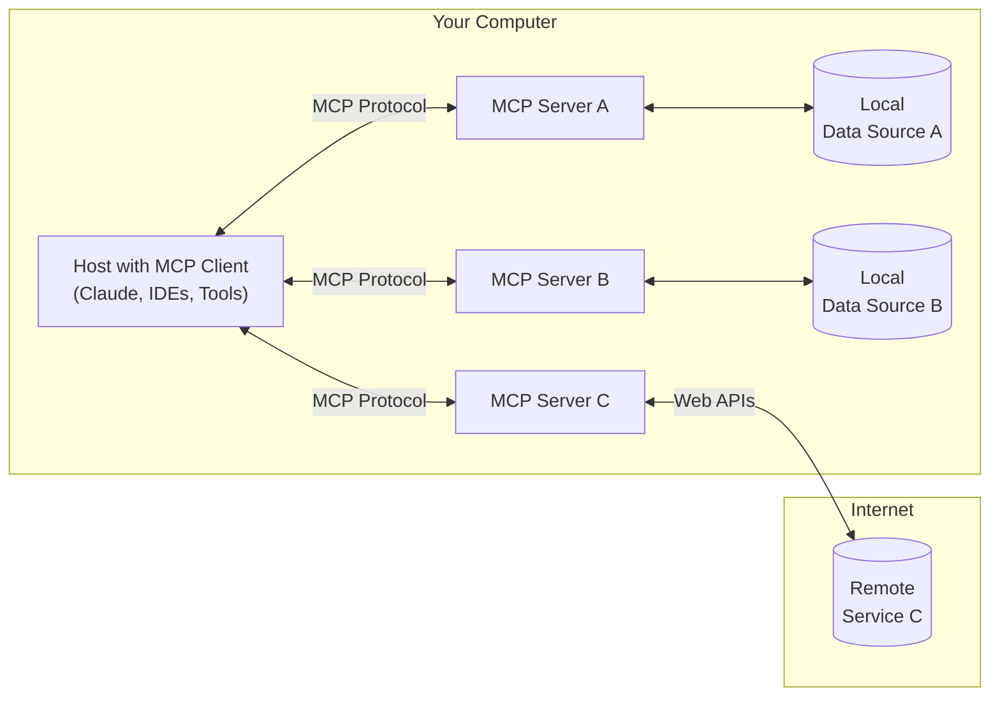

> Java SDK 已发布！请查看[其他更新内容](/development/updates)。

MCP 是一个开放协议，用于标准化应用程序如何为 LLM 提供上下文。可以将 MCP 想象成 AI 应用程序的 USB-C 接口。就像 USB-C 为设备与各种外设之间提供了标准化的连接方式，MCP 为 AI 模型与不同数据源和工具之间提供了标准化的连接方式。

## 为什么选择 MCP？

MCP 帮助您在 LLM 之上构建智能代理和复杂的工作流。LLM 常常需要与数据和工具集成，而 MCP 提供了以下支持：

- 增长中的预构建集成列表，LLM 可直接接入
- 在 LLM 提供商和供应商之间切换的灵活性
- 在您的基础设施内安全保护数据的最佳实践

### 通用架构

从核心上讲，MCP 遵循客户端-服务器架构，其中主机应用程序可以连接到多个服务器：

- **MCP Hosts**: 例如 Claude Desktop、集成开发环境 (IDEs) 或希望通过 MCP 访问数据的 AI 工具；
- **MCP Clients**: 与服务器建立一对一连接的协议客户端；
- **MCP Servers**: 轻量级程序，通过标准化的 Model Context Protocol 提供特定功能；
- **本地数据源**: 您计算机上的文件、数据库和服务，MCP 服务器可以安全访问它们；
- **远程服务**: 通过网络（如 API）可访问的外部系统，MCP 服务器能与之连接。

## 快速入门

选择最适合您的路径：

### 快速开始

- **[面向服务器开发者](quickstart/server)**：开始构建您自己的服务器，可用于 Claude for Desktop 和其他客户端；
- **[面向客户端开发者](quickstart/client)**：开始构建您自己的客户端，可与所有 MCP 服务器集成；
- **[面向 Claude Desktop 用户](quickstart/user)**：开始使用 Claude for Desktop 中的预构建服务器。

### 示例

- **[示例服务器](examples)**：查看官方 MCP 服务器和实现的展示库；
- **[示例客户端](clients)**：查看支持 MCP 集成的客户端列表。

## 教程

- **[使用 LLM 构建 MCP](tutorials/building-mcp-with-llms)**：学习如何利用 LLM（例如 Claude）加速 MCP 开发；
- **[调试指南](docs/tools/debugging)**：学习如何高效调试 MCP 服务器和集成；
- **[MCP Inspector](docs/tools/inspector)**：使用我们的交互式调试工具测试并检查您的 MCP 服务器。

## 探索 MCP

深入了解 MCP 的核心概念和功能：

- **[核心架构](docs/concepts/architecture)**：理解 MCP 如何连接客户端、服务器和 LLM；
- **[资源](docs/concepts/resources)**：将服务器中的数据和内容暴露给 LLM；
- **[Prompts](docs/concepts/prompts)**：创建可重用的提示模板和工作流；
- **[工具](docs/concepts/tools)**：让 LLM 能够通过您的服务器执行操作；
- **[采样](docs/concepts/sampling)**：让您的服务器向 LLM 请求补全内容
- **[传输](docs/concepts/transports)**：了解 MCP 的通信机制。

## 贡献

想要贡献？请查阅我们的[贡献指南](development/contributing)来了解如何帮助改进 MCP。

## 支持与反馈

以下是获取帮助或提供反馈的方式：

- 针对 MCP 规范、SDK 或文档（开源）的错误报告和功能请求，请[创建一个 GitHub issue](https://github.com/modelcontextprotocol)；
- 关于 MCP 规范的讨论或问答，请使用[规范讨论](https://github.com/modelcontextprotocol/specification/discussions)；
- 关于其他 MCP 开源组件的讨论或问答，请使用[组织讨论](https://github.com/orgs/modelcontextprotocol/discussions)；
- 针对 Claude.app 和 claude.ai 的 MCP 集成相关的错误报告、功能请求和问题，请发送邮件至 [mcp-support@anthropic.com](mailto://mcp-support@anthropic.com)。
