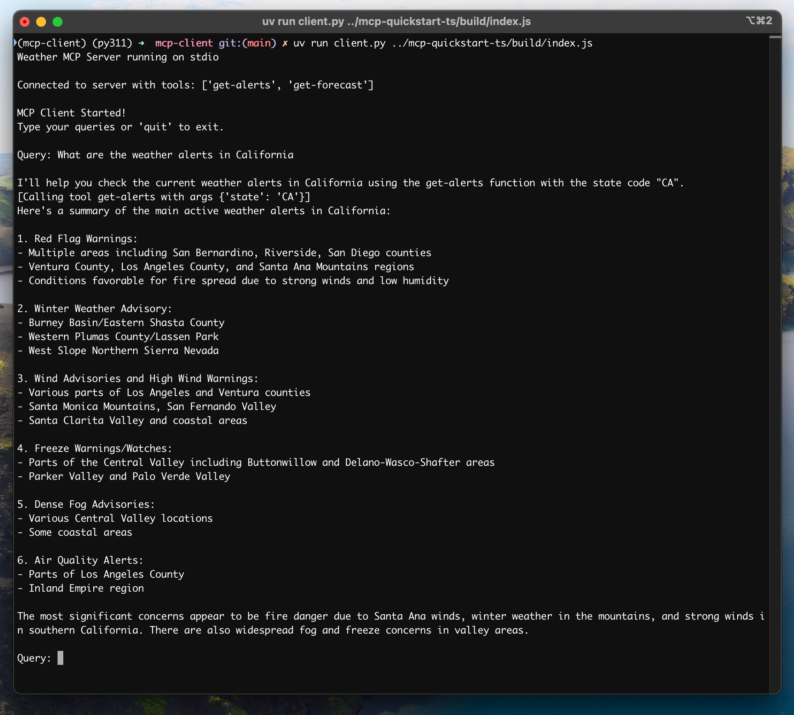
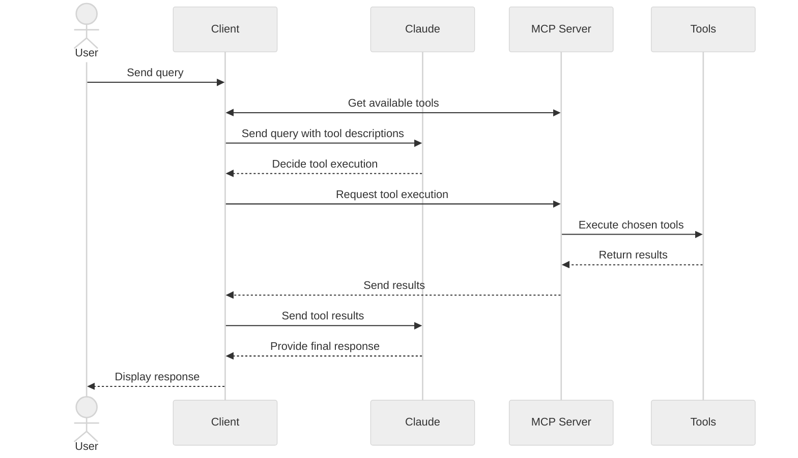

开始构建可以与所有 MCP 服务器集成的自己的客户端。

在本教程中，您将学习如何构建一个由 MCP 服务器驱动的聊天机器人客户端。阅读[服务器快速入门指南](/docs/quickstart/server)将帮助您完成构建第一个服务器的基础知识。



{}

你可以在 [mcp-client-python](https://github.com/modelcontextprotocol/quickstart-resources/tree/main/mcp-client-python) 找到本例的源代码。

## 系统要求

开始之前，请确保您的系统满足以下要求：

- Mac 或 Windows 计算机
- 已安装最新的 Python 版本
- 已安装最新版本的 `uv`

## 设置环境

首先，使用 `uv` 创建一个新的 Python 项目：

```python
# Create project directory
uv init mcp-client
cd mcp-client

# Create virtual environment
uv venv

# Activate virtual environment
# On Windows:
.venv\Scripts\activate
# On Unix or MacOS:
source .venv/bin/activate

# Install required packages
uv add mcp anthropic python-dotenv

# Remove boilerplate files
rm hello.py

# Create our main file
touch client.py
```

### 设置 API 密钥

需要来自 [Anthropic Console](https://console.anthropic.com/settings/keys) 的 Anthropic API 密钥。

创建一个 `.env` 文件来存储它：

```bash
# Create .env file
touch .env
```

```ini
ANTHROPIC_API_KEY=<your key here>
```

将 `.env` 添加到你的 `.gitignore` ：

```bash
echo ".env" >> .gitignore
```

> 确保 ANTHROPIC_API_KEY 的安全！

## 创建客户端

### 客户端基本结构

首先，让我们设置导入并创建基本的客户端类：

```yaml
import asyncio
from typing import Optional
from contextlib import AsyncExitStack

from mcp import ClientSession, StdioServerParameters
from mcp.client.stdio import stdio_client

from anthropic import Anthropic
from dotenv import load_dotenv

load_dotenv()  # load environment variables from .env

class MCPClient:
    def __init__(self):
        # Initialize session and client objects
        self.session: Optional[ClientSession] = None
        self.exit_stack = AsyncExitStack()
        self.anthropic = Anthropic()
    # methods will go here
```

### 服务器连接管理

接下来，我们将实现连接 MCP 服务器的方法：

```python
async def connect_to_server(self, server_script_path: str):
    """Connect to an MCP server

    Args:
        server_script_path: Path to the server script (.py or .js)
    """
    is_python = server_script_path.endswith('.py')
    is_js = server_script_path.endswith('.js')
    if not (is_python or is_js):
        raise ValueError("Server script must be a .py or .js file")

    command = "python" if is_python else "node"
    server_params = StdioServerParameters(
        command=command,
        args=[server_script_path],
        env=None
    )

    stdio_transport = await self.exit_stack.enter_async_context(stdio_client(server_params))
    self.stdio, self.write = stdio_transport
    self.session = await self.exit_stack.enter_async_context(ClientSession(self.stdio, self.write))

    await self.session.initialize()

    # List available tools
    response = await self.session.list_tools()
    tools = response.tools
    print("\nConnected to server with tools:", [tool.name for tool in tools])
```

### 查询处理逻辑

现在让我们添加处理查询和处理工具调用的核心功能：

```python
async def process_query(self, query: str) -> str:
    """Process a query using Claude and available tools"""
    messages = [
        {
            "role": "user",
            "content": query
        }
    ]

    response = await self.session.list_tools()
    available_tools = [{
        "name": tool.name,
        "description": tool.description,
        "input_schema": tool.inputSchema
    } for tool in response.tools]

    # Initial Claude API call
    response = self.anthropic.messages.create(
        model="claude-3-5-sonnet-20241022",
        max_tokens=1000,
        messages=messages,
        tools=available_tools
    )

    # Process response and handle tool calls
    final_text = []

    assistant_message_content = []
    for content in response.content:
        if content.type == 'text':
            final_text.append(content.text)
            assistant_message_content.append(content)
        elif content.type == 'tool_use':
            tool_name = content.name
            tool_args = content.input

            # Execute tool call
            result = await self.session.call_tool(tool_name, tool_args)
            final_text.append(f"[Calling tool {tool_name} with args {tool_args}]")

            assistant_message_content.append(content)
            messages.append({
                "role": "assistant",
                "content": assistant_message_content
            })
            messages.append({
                "role": "user",
                "content": [
                    {
                        "type": "tool_result",
                        "tool_use_id": content.id,
                        "content": result.content
                    }
                ]
            })

            # Get next response from Claude
            response = self.anthropic.messages.create(
                model="claude-3-5-sonnet-20241022",
                max_tokens=1000,
                messages=messages,
                tools=available_tools
            )

            final_text.append(response.content[0].text)

    return "\n".join(final_text)
```

### 交互式聊天界面

现在我们将添加聊天循环和清理功能：

```python
async def chat_loop(self):
    """Run an interactive chat loop"""
    print("\nMCP Client Started!")
    print("Type your queries or 'quit' to exit.")

    while True:
        try:
            query = input("\nQuery: ").strip()

            if query.lower() == 'quit':
                break

            response = await self.process_query(query)
            print("\n" + response)

        except Exception as e:
            print(f"\nError: {str(e)}")

async def cleanup(self):
    """Clean up resources"""
    await self.exit_stack.aclose()
```

### 查询处理逻辑

现在让我们添加处理查询和处理工具调用的核心功能：

```python
async def main():
    if len(sys.argv) < 2:
        print("Usage: python client.py <path_to_server_script>")
        sys.exit(1)

    client = MCPClient()
    try:
        await client.connect_to_server(sys.argv[1])
        await client.chat_loop()
    finally:
        await client.cleanup()

if __name__ == "__main__":
    import sys
    asyncio.run(main())
```

您可以在[此处](https://gist.github.com/zckly/f3f28ea731e096e53b39b47bf0a2d4b1)找到完整的 client.py 文件 。

### 关键组件说明

#### 客户端初始化

- `MCPClient` 类使用会话管理和 API 客户端进行初始化
- 使用 `AsyncExitStack` 进行适当的资源管理
- 配置 Anthropic 客户端以进行 Claude 交互

#### 服务器连接

- 支持 Python 和 Node.js 服务器
- 验证服务器脚本类型
- 建立合适的通信方法
- 初始化会话并列出可用的工具

#### 查询处理

- 保持对话上下文
- 处理 Claude 的响应和工具调用
- 管理 Claude 和工具之间的消息流
- 将结果整合成一个连贯的响应

#### 交互界面

- 提供简单的命令行界面
- 处理用户输入并显示响应
- 包括基本错误处理
- 允许优雅退出

#### 资源管理

- 正确清理资源
- 连接问题的错误处理
- 优雅关闭程序

### 定制行为

#### Tools 处理

- 修改 `process_query()` 处理特定的工具类型
- 为工具调用添加自定义错误处理
- 为工具实现特定的响应格式

#### 响应处理

- 为工具返回结果定义格式
- 添加针对响应的过滤或者转换
- 实现自定义日志记录

#### 用户界面

- 添加 GUI 或者 Web 界面
- 实现丰富的控制台输出
- 添加命令历史记录或者自动完成功能

## 运行客户端

当您提交查询时：

```bash
uv run client.py path/to/server.py # python server
uv run client.py path/to/build/index.js # node server
```

> 如果您继续服务器快速入门中的天气教程
> 您的命令可能如下所示：
> `python client.py .../weather/src/weather/server.py`

客户端会：

1. 连接到指定服务器
1. 列出可用工具
1. 启动交互式聊天对话：
    - 输入查询
    - 查看工具执行
    - 获取 Claude 的响应

下面是从服务器快速启动连接到天气服务器时的示例：



## 工作原理

当你提交查询时：

1. 客户端从服务器获取可用工具列表
1. 您的查询将连同工具描述一起发送给 Claude
1. Claude 决定使用哪些工具（如果有的话）
1. 客户端通过服务器执行任何请求的工具调用
1. 结果发回给 Claude
1. Claude 提供了自然语言响应
1. 响应将显示给您

## 最佳实践

### 错误处理

- 始终将工具调用包装在 try-catch 块中
- 提供有意义的错误消息
- 妥善处理连接问题

### 资源管理

- 使用 `AsyncExitStack` 进行适当的清理
- 完成后关闭连接
- 处理服务器断开连接

### 安全

- 将 API 密钥安全地存储在 `.env` 中
- 验证服务器响应
- 谨慎使用工具权限

## 故障排除

### 服务器路径问题

- 仔细检查服务器脚本的路径是否正确
- 如果相对路径不起作用，请使用绝对路径
- 对于 Windows 用户，请确保在路径中使用正斜杠（/）或转义反斜杠(\)
- 验证服务器文件具有正确的扩展名（Python 为 `.py`，Node.js 为 `.js`）

正确路径使用示例：

```bash
# Relative path
uv run client.py ./server/weather.py

# Absolute path
uv run client.py /Users/username/projects/mcp-server/weather.py

# Windows path (either format works)
uv run client.py C:/projects/mcp-server/weather.py
uv run client.py C:\\projects\\mcp-server\\weather.py
```

### 响应时间

- 第一个响应可能需要长达 30 秒才能返回
- 这是正常现象，发生于：
    - 服务器初始化
    - Claude 处理查询
    - 工具正在被执行
- 后续响应通常更快
- 在最初的等待期间不要中断该过程

### 常见错误消息

如果你看到：

- `FileNotFoundError`：检查你的服务器路径
- `Connection refused`：确保服务器正在运行并且路径正确
- `Tool execution failed`：验证工具所需的环境变量是否已设置
- `Timeout error` ：考虑增加客户端配置中的超时时间

{}
{}

你可以在 [mcp-client-typescript](https://github.com/modelcontextprotocol/quickstart-resources/tree/main/mcp-client-typescript) 项目中找到本例中所使用的源代码。

## 系统要求

开始之前，请确保您的系统满足以下要求：

- Mac 或 Windows 计算机
- 已安装 Node.js 16 或更高版本
- 已安装最新版本的 `npm`
- Anthropic API 密钥（Claude）

## 设置环境

首先，让我们创建并设置我们的项目：

- **MacOS/Linux**

```bash
# Create project directory
mkdir mcp-client-typescript
cd mcp-client-typescript

# Initialize npm project
npm init -y

# Install dependencies
npm install @anthropic-ai/sdk @modelcontextprotocol/sdk dotenv

# Install dev dependencies
npm install -D @types/node typescript

# Create source file
touch index.ts
```

- **Windows**

```powershell
# Create project directory
md mcp-client-typescript
cd mcp-client-typescript

# Initialize npm project
npm init -y

# Install dependencies
npm install @anthropic-ai/sdk @modelcontextprotocol/sdk dotenv

# Install dev dependencies
npm install -D @types/node typescript

# Create source file
new-item index.ts
```

更新你的 `package.json` 以设置 `type: "module"` 和构建脚本：

```json
{
  "type": "module",
  "scripts": {
    "build": "tsc && chmod 755 build/index.js"
  }
}
```

在项目根目录中创建一个 `tsconfig.json`：

```json
{
  "compilerOptions": {
    "target": "ES2022",
    "module": "Node16",
    "moduleResolution": "Node16",
    "outDir": "./build",
    "rootDir": "./",
    "strict": true,
    "esModuleInterop": true,
    "skipLibCheck": true,
    "forceConsistentCasingInFileNames": true
  },
  "include": ["index.ts"],
  "exclude": ["node_modules"]
}
```

### 设置你的 API 密钥

需要来自 [Anthropic Console](https://console.anthropic.com/settings/keys) 的 Anthropic API 密钥。

创建一个 `.env` 文件来存储它：

```bash
echo "ANTHROPIC_API_KEY=<your key here>" > .env
```

将 `.env` 添加到你的 `.gitignore`：

> 确保 `ANTHROPIC_API_KEY` 的安全！

## 客户端基本结构

首先，让我们设置导入并在 `index.ts` 中创建基本的客户端类：

```typescript
import { Anthropic } from "@anthropic-ai/sdk";
import {
  MessageParam,
  Tool,
} from "@anthropic-ai/sdk/resources/messages/messages.mjs";
import { Client } from "@modelcontextprotocol/sdk/client/index.js";
import { StdioClientTransport } from "@modelcontextprotocol/sdk/client/stdio.js";
import readline from "readline/promises";
import dotenv from "dotenv";

dotenv.config();

const ANTHROPIC_API_KEY = process.env.ANTHROPIC_API_KEY;
if (!ANTHROPIC_API_KEY) {
  throw new Error("ANTHROPIC_API_KEY is not set");
}

class MCPClient {
  private mcp: Client;
  private anthropic: Anthropic;
  private transport: StdioClientTransport | null = null;
  private tools: Tool[] = [];

  constructor() {
    this.anthropic = new Anthropic({
      apiKey: ANTHROPIC_API_KEY,
    });
    this.mcp = new Client({ name: "mcp-client-cli", version: "1.0.0" });
  }
  // methods will go here
}
```

### 服务器连接管理

接下来，我们将实现连接 MCP 服务器的方法：

```typescript
async connectToServer(serverScriptPath: string) {
  try {
    const isJs = serverScriptPath.endsWith(".js");
    const isPy = serverScriptPath.endsWith(".py");
    if (!isJs && !isPy) {
      throw new Error("Server script must be a .js or .py file");
    }
    const command = isPy
      ? process.platform === "win32"
        ? "python"
        : "python3"
      : process.execPath;
    
    this.transport = new StdioClientTransport({
      command,
      args: [serverScriptPath],
    });
    this.mcp.connect(this.transport);
    
    const toolsResult = await this.mcp.listTools();
    this.tools = toolsResult.tools.map((tool) => {
      return {
        name: tool.name,
        description: tool.description,
        input_schema: tool.inputSchema,
      };
    });
    console.log(
      "Connected to server with tools:",
      this.tools.map(({ name }) => name)
    );
  } catch (e) {
    console.log("Failed to connect to MCP server: ", e);
    throw e;
  }
}
```

### 查询处理逻辑

现在让我们添加处理查询和处理工具调用的核心功能：

```typescript
async processQuery(query: string) {
  const messages: MessageParam[] = [
    {
      role: "user",
      content: query,
    },
  ];

  const response = await this.anthropic.messages.create({
    model: "claude-3-5-sonnet-20241022",
    max_tokens: 1000,
    messages,
    tools: this.tools,
  });

  const finalText = [];
  const toolResults = [];

  for (const content of response.content) {
    if (content.type === "text") {
      finalText.push(content.text);
    } else if (content.type === "tool_use") {
      const toolName = content.name;
      const toolArgs = content.input as { [x: string]: unknown } | undefined;

      const result = await this.mcp.callTool({
        name: toolName,
        arguments: toolArgs,
      });
      toolResults.push(result);
      finalText.push(
        `[Calling tool ${toolName} with args ${JSON.stringify(toolArgs)}]`
      );

      messages.push({
        role: "user",
        content: result.content as string,
      });

      const response = await this.anthropic.messages.create({
        model: "claude-3-5-sonnet-20241022",
        max_tokens: 1000,
        messages,
      });

      finalText.push(
        response.content[0].type === "text" ? response.content[0].text : ""
      );
    }
  }

  return finalText.join("\n");
}
```

### 交互式聊天界面

现在我们将添加聊天循环和清理功能：

```typescript
async chatLoop() {
  const rl = readline.createInterface({
    input: process.stdin,
    output: process.stdout,
  });

  try {
    console.log("\nMCP Client Started!");
    console.log("Type your queries or 'quit' to exit.");

    while (true) {
      const message = await rl.question("\nQuery: ");
      if (message.toLowerCase() === "quit") {
        break;
      }
      const response = await this.processQuery(message);
      console.log("\n" + response);
    }
  } finally {
    rl.close();
  }
}

async cleanup() {
  await this.mcp.close();
}
```

### 主入口

最后，我们添加主要的执行逻辑：

```typescript
async function main() {
  if (process.argv.length < 3) {
    console.log("Usage: node index.ts <path_to_server_script>");
    return;
  }
  const mcpClient = new MCPClient();
  try {
    await mcpClient.connectToServer(process.argv[2]);
    await mcpClient.chatLoop();
  } finally {
    await mcpClient.cleanup();
    process.exit(0);
  }
}

main();
```

## 运行客户端

要使用任何 MCP 服务器运行您的客户端：

```bash
# Build TypeScript
npm run build

# Run the client
node build/index.js path/to/server.py # python server
node build/index.js path/to/build/index.js # node server
```

> 如果您继续服务器快速入门中的天气教程，您的命令可能如下所示：
> `node build/index.js .../quickstart-resources/weather-server-typescript/build/index.js`

### 客户端的行为

1. 连接到指定服务器
1. 列出可用的工具
1. 启动交互式聊天会话，您可以：
    - 输入查询
    - 查看工具执行
    - 获取 Claude 的回应

## 工作原理

当您提交查询时：

1. 客户端从服务器获取可用工具列表
1. 您的查询将连同工具描述一起发送给 Claude
1. Claude 决定使用哪些工具（如果有的话）
1. 客户端通过服务器执行任何请求的工具调用
1. 结果发回给 Claude
1. Claude 提供了自然语言响应
1. 显示响应内容

## 最佳实践

### 错误处理

- 使用 TypeScript 的类型系统来更好地检测错误
- 将工具调用包装在 `try-catch`块中
- 提供有意义的错误消息
- 妥善处理连接问题

### 安全

- 将 API 密钥安全地存储在 `.env` 中
- 对服务器响应进行验证
- 谨慎使用工具权限

## 排除故障

### 服务器路径问题

- 仔细检查服务器脚本的路径是否正确
- 如果相对路径不起作用，请使用绝对路径
- 对于 Windows 用户，请确保在路径中使用正斜杠（`/`）或转义反斜杠(`\`)
- 验证服务器文件具有正确的扩展名（Node.js 为 `.js` 或 Python 为 `.py`）

正确路径使用示例：

```shell
# Relative path
node build/index.js ./server/build/index.js

# Absolute path
node build/index.js /Users/username/projects/mcp-server/build/index.js

# Windows path (either format works)
node build/index.js C:/projects/mcp-server/build/index.js
node build/index.js C:\\projects\\mcp-server\\build\\index.js
```

### 响应时间

- 第一个响应可能需要长达 30 秒才能返回
- 这是正常现象，发生于：
    - 服务器初始化
    - Claude 处理查询
    - 工具正在执行
- 后续响应通常会变快
- 最初的等待期间不要中断

### 常见错误消息

如果你看到：

- `Error: Cannot find module`：检查​​您的构建文件夹并确保 TypeScript 编译成功
- `Connection refused`：确保服务器正在运行并且路径正确
- `Tool execution failed`：验证工具所需的环境变量是否已设置
- `ANTHROPIC_API_KEY is not set`：检查您的 `.env` 文件和环境变量
- `TypeError`：确保您使用了正确的工具参数类型

{}
{}

> 这是基于 Spring AI MCP 自动配置和启动器的快速入门演示。要了解如何手动创建同步和异步 MCP 客户端，请参阅 [Java SDK 客户端文档](https://modelcontextprotocol.io/sdk/java/mcp-client)

此示例演示如何构建一个将 Spring AI 的模型上下文协议 (MCP) 与 [Brave Search MCP 服务器](https://github.com/modelcontextprotocol/servers/tree/main/src/brave-search)相结合的交互式聊天机器人。该应用程序创建了一个由 Anthropic 的 Claude AI 模型提供支持的对​​话界面，该界面可以通过 Brave Search 执行互联网搜索，从而实现与实时网络数据的自然语言交互。 您可以在 [brave-chatbot 项目中](https://github.com/spring-projects/spring-ai-examples/tree/main/model-context-protocol/web-search/brave-chatbot)找到本教程的完整代码。

## 系统要求

开始之前，请确保您的系统满足以下要求：

- Java 17 或更高版本
- Maven 3.6+
- npx 包管理器
- Anthropic API key (Claude)
- Brave Search API key

## 环境设置

1. 安装 npx (Node Package eXecute)：首先，确保安装 npm 然后运行：`npm install -g npx`
1. 克隆代码仓

    ```bash
    git clone https://github.com/spring-projects/spring-ai-examples.git
    cd model-context-protocol/brave-chatbot
    ```

1. 设置 API Key

    ```bash
    export ANTHROPIC_API_KEY='your-anthropic-api-key-here'
    export BRAVE_API_KEY='your-brave-api-key-here'
    ```

1. 构建应用程序：`/mvnw clean install`
1. 使用 Maven 运行应用：`./mvnw spring-boot:run`

> 务必注意 `ANTHROPIC_API_KEY` 和 `BRAVE_API_KEY` 密钥的安全！

## 工作原理

该应用程序通过几个组件将 Spring AI 与 Brave Search MCP 服务器集成在一起：

### MCP 客户端配置

1. `pom.xml` 中必需的依赖项：

    ```xml
    <dependency>
        <groupId>org.springframework.ai</groupId>
        <artifactId>spring-ai-mcp-client-spring-boot-starter</artifactId>
    </dependency>
    <dependency>
        <groupId>org.springframework.ai</groupId>
        <artifactId>spring-ai-anthropic-spring-boot-starter</artifactId>
    </dependency>
    ```

1. 应用程序属性（`application.yml`）：

    ```yaml
    spring:
      ai:
        mcp:
          client:
            enabled: true
            name: brave-search-client
            version: 1.0.0
            type: SYNC
            request-timeout: 20s
            stdio:
              root-change-notification: true
              servers-configuration: classpath:/mcp-servers-config.json
        anthropic:
          api-key: ${ANTHROPIC_API_KEY}
    ```

    这将激活 `spring-ai-mcp-client-spring-boot-starter`，以根据提供的服务器配置创建一个或多个 `McpClient`。

1. MCP 服务器配置（`mcp-servers-config.json`）：

    ```json
    {
      "mcpServers": {
        "brave-search": {
          "command": "npx",
          "args": [
            "-y",
            "@modelcontextprotocol/server-brave-search"
          ],
          "env": {
            "BRAVE_API_KEY": "<PUT YOUR BRAVE API KEY>"
          }
        }
      }
    }    
    ```

### 聊天实现

该聊天机器人是使用 Spring AI 的 ChatClient 与 MCP 工具集成实现的：

```java
var chatClient = chatClientBuilder
    .defaultSystem("You are useful assistant, expert in AI and Java.")
    .defaultTools((Object[]) mcpToolAdapter.toolCallbacks())
    .defaultAdvisors(new MessageChatMemoryAdvisor(new InMemoryChatMemory()))
    .build();
```

主要特点：

- 使用 Claude 人工智能模型进行自然语言理解
- 通过 MCP 整合 Brave Search，提供实时网络搜索功能
- 使用 InMemoryChatMemory 保持对话记忆
- 用交互式命令行的形式运行

### 构建和运行

```bash
./mvnw clean install
java -jar ./target/ai-mcp-brave-chatbot-0.0.1-SNAPSHOT.jar
```

或者

```bash
./mvnw spring-boot:run
```

该应用程序将启动一个交互式聊天会话，您可以在其中提问。聊天机器人会在有需要时，使用 Brave Search 从互联网上查找信息来回答您的疑问。

聊天机器人可以：

- 使用内置知识回答问题
- 在需要时使用 Brave Search 执行网络搜索
- 记住对话中先前消息的上下文
- 结合多种来源的信息提供全面的答案

### 高级配置

MCP 客户端支持附加配置选项：

- 通过 `McpSyncClientCustomizer` 或 `McpAsyncClientCustomizer` 进行客户端定制
- 具有多种传输类型的多个客户端：`STDIO` 和 `SSE`（服务器发送事件）
- 与 Spring AI 的工具执行框架集成
- 自动客户端初始化和生命周期管理

对于基于 WebFlux 的应用程序，您可以改用 WebFlux 启动器：

```xml
<dependency>
    <groupId>org.springframework.ai</groupId>
    <artifactId>spring-ai-mcp-client-webflux-spring-boot-starter</artifactId>
</dependency>
```

它提供了类似的功能，但使用基于 WebFlux 的 SSE 传输实现，推荐用于生产部署。

{}
{}

您可以在 [kotlin-mcp-client](https://github.com/modelcontextprotocol/kotlin-sdk/tree/main/samples/kotlin-mcp-client) 找到本教程的完整代码。

## 系统要求

开始之前，请确保您的系统满足以下要求：

- Java 17 或更高版本
- Anthropic API key (Claude)

## 设置环境

首先，如果你还没有安装 Java 和 Gradle ，我们先安装一下。你可以从 [Oracle JDK 官方网站](https://www.oracle.com/java/technologies/downloads/)下载 Java 。验证你的 Java 安装：`java --version`

现在，让我们创建并设置您的项目：

- **MacOS/Linux**：

```bash
# Create a new directory for our project
mkdir kotlin-mcp-client
cd kotlin-mcp-client

# Initialize a new kotlin project
gradle init
```

- **Windows**

```bash
# Create a new directory for our project
md kotlin-mcp-client
cd kotlin-mcp-client
# Initialize a new kotlin project
gradle init
```

运行 `gradle init` 后，您将看到创建项目的选项。选择应用程序作为项目类型， 选择 Kotlin 作为编程语言，选择 Java 17 作为 Java 版本。

或者，您可以使用 [IntelliJ IDEA 项目向导](https://kotlinlang.org/docs/jvm-get-started.html) 创建 Kotlin 应用程序。

创建项目后，添加以下依赖项：

- **build.gradle.kts**

```groovy
val mcpVersion = "0.3.0"
val slf4jVersion = "2.0.9"
val anthropicVersion = "0.8.0"

dependencies {
    implementation("io.modelcontextprotocol:kotlin-sdk:$mcpVersion")
    implementation("org.slf4j:slf4j-nop:$slf4jVersion")
    implementation("com.anthropic:anthropic-java:$anthropicVersion")
}
```

- **build.gradle**

```groovy
def mcpVersion = '0.3.0'
def slf4jVersion = '2.0.9'
def anthropicVersion = '0.8.0'
dependencies {
    implementation "io.modelcontextprotocol:kotlin-sdk:$mcpVersion"
    implementation "org.slf4j:slf4j-nop:$slf4jVersion"
    implementation "com.anthropic:anthropic-java:$anthropicVersion"
}
```

另外，将以下插件添加到您的构建脚本中：

- **build.gradle.kts**

```groovy
plugins {
    id("com.github.johnrengelman.shadow") version "8.1.1"
}
```

- **build.gradle**

```groovy build.gradle
plugins {
    id 'com.github.johnrengelman.shadow' version '8.1.1'
}
```

### 设置 API 密钥

您需要来自 [Anthropic Console](https://console.anthropic.com/settings/keys) 的 Anthropic API 密钥。

设置您的 API 密钥：`export ANTHROPIC_API_KEY='your-anthropic-api-key-here'`

> 注意保护 `ANTHROPIC_API_KEY` 的安全！

## 创建客户端

### 客户端基本结构

首先创建基本的客户端类：

```java
class MCPClient : AutoCloseable {
    private val anthropic = AnthropicOkHttpClient.fromEnv()
    private val mcp: Client = Client(clientInfo = Implementation(name = "mcp-client-cli", version = "1.0.0"))
    private lateinit var tools: List<ToolUnion>

    // methods will go here

    override fun close() {
        runBlocking {
            mcp.close()
            anthropic.close()
        }
    }
```

### 服务器连接管理

接下来，我们将实现连接 MCP 服务器的方法：


```java
suspend fun connectToServer(serverScriptPath: String) {
    try {
        val command = buildList {
            when (serverScriptPath.substringAfterLast(".")) {
                "js" -> add("node")
                "py" -> add(if (System.getProperty("os.name").lowercase().contains("win")) "python" else "python3")
                "jar" -> addAll(listOf("java", "-jar"))
                else -> throw IllegalArgumentException("Server script must be a .js, .py or .jar file")
            }
            add(serverScriptPath)
        }

        val process = ProcessBuilder(command).start()
        val transport = StdioClientTransport(
            input = process.inputStream.asSource().buffered(),
            output = process.outputStream.asSink().buffered()
        )

        mcp.connect(transport)

        val toolsResult = mcp.listTools()
        tools = toolsResult?.tools?.map { tool ->
            ToolUnion.ofTool(
                Tool.builder()
                    .name(tool.name)
                    .description(tool.description ?: "")
                    .inputSchema(
                        Tool.InputSchema.builder()
                            .type(JsonValue.from(tool.inputSchema.type))
                            .properties(tool.inputSchema.properties.toJsonValue())
                            .putAdditionalProperty("required", JsonValue.from(tool.inputSchema.required))
                            .build()
                    )
                    .build()
            )
        } ?: emptyList()
        println("Connected to server with tools: ${tools.joinToString(", ") { it.tool().get().name() }}")
    } catch (e: Exception) {
        println("Failed to connect to MCP server: $e")
        throw e
    }
}
```

### 查询处理逻辑

现在让我们添加处理查询和处理工具调用的核心功能：

```java
private val messageParamsBuilder: MessageCreateParams.Builder = MessageCreateParams.builder()
    .model(Model.CLAUDE_3_5_SONNET_20241022)
    .maxTokens(1024)

suspend fun processQuery(query: String): String {
    val messages = mutableListOf(
        MessageParam.builder()
            .role(MessageParam.Role.USER)
            .content(query)
            .build()
    )

    val response = anthropic.messages().create(
        messageParamsBuilder
            .messages(messages)
            .tools(tools)
            .build()
    )

    val finalText = mutableListOf<String>()
    response.content().forEach { content ->
        when {
            content.isText() -> finalText.add(content.text().getOrNull()?.text() ?: "")

            content.isToolUse() -> {
                val toolName = content.toolUse().get().name()
                val toolArgs =
                    content.toolUse().get()._input().convert(object : TypeReference<Map<String, JsonValue>>() {})

                val result = mcp.callTool(
                    name = toolName,
                    arguments = toolArgs ?: emptyMap()
                )
                finalText.add("[Calling tool $toolName with args $toolArgs]")

                messages.add(
                    MessageParam.builder()
                        .role(MessageParam.Role.USER)
                        .content(
                            """
                                "type": "tool_result",
                                "tool_name": $toolName,
                                "result": ${result?.content?.joinToString("\n") { (it as TextContent).text ?: "" }}
                            """.trimIndent()
                        )
                        .build()
                )

                val aiResponse = anthropic.messages().create(
                    messageParamsBuilder
                        .messages(messages)
                        .build()
                )

                finalText.add(aiResponse.content().first().text().getOrNull()?.text() ?: "")
            }
        }
    }

    return finalText.joinToString("\n", prefix = "", postfix = "")
}
```

### 互动聊天

实现聊天循环：

```java
suspend fun chatLoop() {
    println("\nMCP Client Started!")
    println("Type your queries or 'quit' to exit.")

    while (true) {
        print("\nQuery: ")
        val message = readLine() ?: break
        if (message.lowercase() == "quit") break
        val response = processQuery(message)
        println("\n$response")
    }
}
```

### 主入口点

最后，我们添加主要执行函数：

```java
fun main(args: Array<String>) = runBlocking {
    if (args.isEmpty()) throw IllegalArgumentException("Usage: java -jar <your_path>/build/libs/kotlin-mcp-client-0.1.0-all.jar <path_to_server_script>")
    val serverPath = args.first()
    val client = MCPClient()
    client.use {
        client.connectToServer(serverPath)
        client.chatLoop()
    }
}
```

## 运行客户端

```bash
./gradlew build

# Run the client
java -jar build/libs/<your-jar-name>.jar path/to/server.jar # jvm server
java -jar build/libs/<your-jar-name>.jar path/to/server.py # python server
java -jar build/libs/<your-jar-name>.jar path/to/build/index.js # node server
```

> 如果使用服务器快速入门中的天气教程，您的命令可能如下所示： 
> `java -jar build/libs/kotlin-mcp-client-0.1.0-all.jar .../samples/weather-stdio-server/build/libs/weather-stdio-server-0.1.0-all.jar`

客户将会：

1. 连接到指定服务器
1. 列出可用的工具
1. 启动交互式聊天会话，您可以：
    - 输入查询
    - 查看工具执行
    - 获取 Claude 的回应

## 工作机理

下图简单描述了这一流程：



当您提交查询时：

1. 客户端从服务器获取可用工具列表
1. 您的查询将连同工具描述一起发送给 Claude
1. Claude 决定使用哪些工具（如果有的话）
1. 客户端通过服务器执行任何请求的工具调用
1. 结果发回给 Claude
1. Claude 提供自然语言响应

## 最佳实践

### 错误处理

- 利用 Kotlin 的类型系统明确地模拟错误
- 当可能出现异常时，将外部工具和 API 调用包装在 `try-catch` 块中
- 提供清晰且有意义的错误消息
- 妥善处理网络超时和连接问题

### 安全

- 将 API 密钥和机密安全地存储在 `local.properties` 、环境变量或机密管理器中
- 验证所有外部响应，以避免意外或不安全的数据使用
- 使用工具时要谨慎对待权限和信任边界

## 故障排除

### 服务器路径问题

- 仔细检查服务器脚本的路径是否正确
- 如果相对路径不起作用，请使用绝对路径
- 对于 Windows 用户，请确保在路径中使用正斜杠（`/`）或转义反斜杠（`\`）
- 确保已安装所需的运行时（Java 为 `java`、Node.js 为 `npm` 或 Python 为 `uv`）
- 验证服务器文件具有正确的扩展名（Java 为 `.jar`、Node.js 为 `.js` 或 Python 为 `.py`）

正确路径使用示例：

```bash
# Relative path
java -jar build/libs/client.jar ./server/build/libs/server.jar

# Absoulute path
java -jar build/libs/client.jar /Users/username/projects/mcp-server/build/libs/server.jar

# Windows path (either format works)
java -jar build/libs/client.jar C:/projects/mcp-server/build/libs/server.jar
java -jar build/libs/client.jar C:\\projects\\mcp-server\\build\\libs\\server.jar
```

### 响应时间

- 第一个响应可能需要长达 30 秒才能返回
- 这是正常现象，发生于：
    - 服务器初始化
    - Claude 处理查询
    - 正在执行工具
- 后续响应通常更快
- 在最初的等待期间不要中断该过程

### 常见错误消息

如果你看到：

- **`Connection refused`** ：确保服务器正在运行并且路径正确
- **`Tool execution failed`** ：验证工具所需的环境变量是否已设置
- **`ANTHROPIC_API_KEY is not set`** ：检查您的环境变量

{}


## 后续步骤

- [服务器示例](/docs/examples)：查看我们的官方 MCP 服务器列表
- [客户端](/docs/clients)：查看支持 MCP 集成的客户列表
- [使用 LLM 构建 MCP](/docs/tutorials/building-mcp-with-llms)：了解如何使用 Claude 等 LLM 来加速您的 MCP 开发过程
- [Core architecture](/docs/concepts/architecture)：了解 MCP 如何连接客户机、服务器和 LLM
