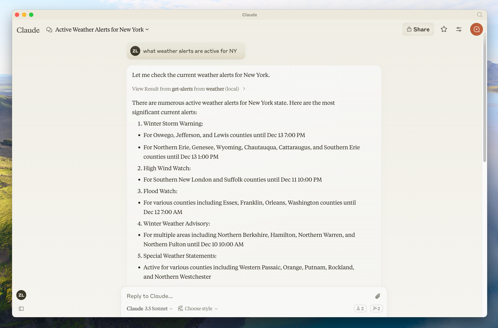
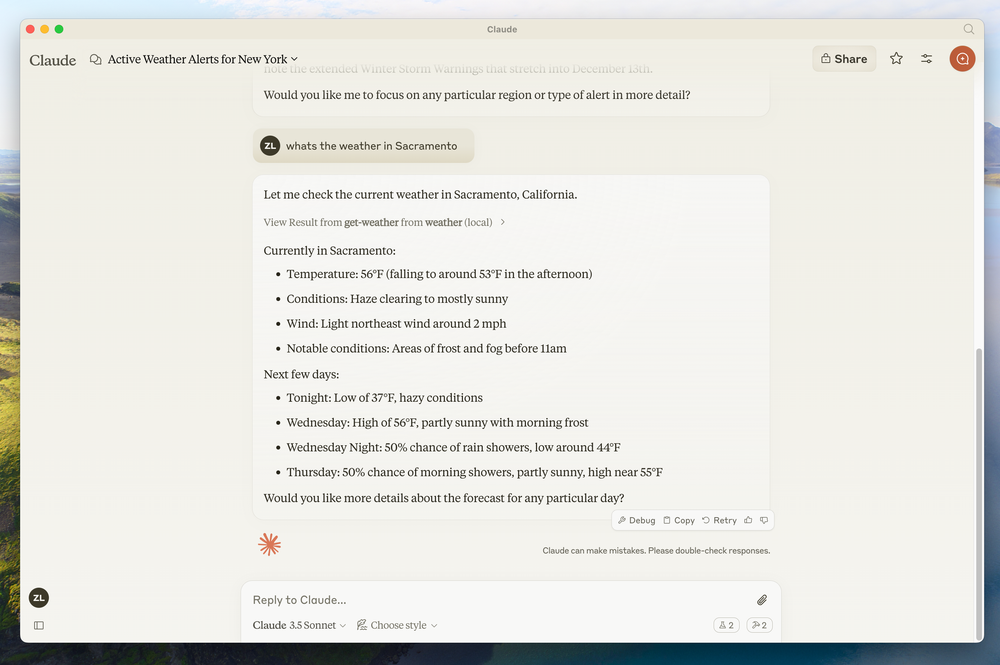
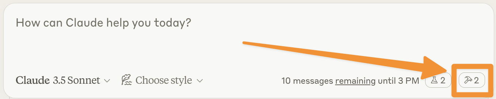
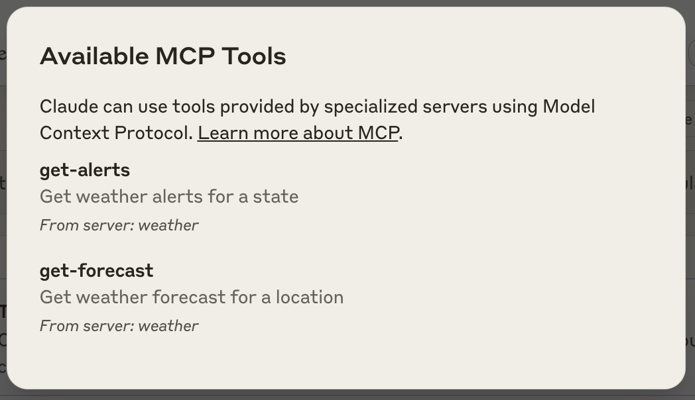

在本教程中，我们将构建一个简单的 MCP 天气服务，并将其连接到 Claude for Desktop 。基础设置开始，逐步实现更复杂的用例。

## 我们将构建什么

许多 LLM（包括 Claude）目前无法获取天气预报和恶劣天气警报。让我们使用 MCP 来解决这个问题！

我们将构建一个服务器，该服务器暴露两个工具：`get-alerts` 和 `get-forecast`。然后，我们将服务器连接到 MCP 主机（在本案例中是 Claude for Desktop）：





> 服务器可以连接到任何客户端。这里我们选择了 Claude for Desktop 来保持简单，但我们还提供了[如何构建您自己的客户端指南](quickstart/client)以及[其他客户端列表](clients)。
>
> "为什么选择 Claude for Desktop 而不是 Claude.ai？"
> 因为服务器是本地运行的，所以 MCP 目前仅支持桌面主机。远程主机正在积极开发中。

## MCP 的核心概念

MCP 服务器可以提供三种主要类型的功能：

1. **资源**：客户端可以读取的类似文件的数据（如 API 响应或文件内容）
2. **工具**：LLM 可调用的函数（需用户批准）
3. **提示**：帮助用户完成特定任务的预写模板

本教程将主要关注工具。



{}

让我们从构建天气服务开始，接下来要构建的全部代码保存在 [`weather-server-python` 项目中](https://github.com/modelcontextprotocol/quickstart-resources/tree/main/weather-server-python)。

### 必备知识

本快速入门假定您熟悉以下内容：

- Python
- 像 Claude 这样的大型语言模型（LLM）

### 系统要求

- 已安装 Python 3.10 或更高版本。
- 您必须使用 Python MCP SDK 1.2.0 或更高版本。

### 环境设置

首先安装 `uv` 并设置 Python 项目和环境：

- **Linux/MacOS**

```sh
curl -LsSf https://astral.sh/uv/install.sh | sh
```

- **Windows**

```powershell
powershell -ExecutionPolicy ByPass -c "irm https://astral.sh/uv/install.ps1 | iex"
```

之后，请确保重启您的终端，以确保 uv 命令能够被识别。

现在，让我们创建并设置我们的项目：

- **Linux/MacOS**

```sh
# Create a new directory for our project
uv init weather
cd weather

# Create virtual environment and activate it
uv venv
source .venv/bin/activate

# Install dependencies
uv add "mcp[cli]" httpx

# Create our server file
touch weather.py
```

- **Windows**

```powershell
# Create a new directory for our project
uv init weather
cd weather

# Create virtual environment and activate it
uv venv
.venv\Scripts\activate

# Install dependencies
uv add mcp[cli] httpx

# Create our server file
new-item weather.py
```

下一步，我们开始构建我们的服务器

### 构建您的服务器

#### 导入包并设置实例

将以下内容添加到您的 `weather.py` 文件顶部：

```python
from typing import Any
import httpx
from mcp.server.fastmcp import FastMCP

# Initialize FastMCP server
mcp = FastMCP("weather")

# Constants
NWS_API_BASE = "https://api.weather.gov"
USER_AGENT = "weather-app/1.0"
```

FastMCP 类使用 Python 类型提示和文档字符串自动生成工具定义，使得创建和维护 MCP 工具变得简单。

#### 辅助函数

接下来，让我们添加一个辅助函数，查询天气服务 API 并对结果数据进行格式化：

```python
async def make_nws_request(url: str) -> dict[str, Any] | None:
    """Make a request to the NWS API with proper error handling."""
    headers = {
        "User-Agent": USER_AGENT,
        "Accept": "application/geo+json"
    }
    async with httpx.AsyncClient() as client:
        try:
            response = await client.get(url, headers=headers, timeout=30.0)
            response.raise_for_status()
            return response.json()
        except Exception:
            return None

def format_alert(feature: dict) -> str:
    """Format an alert feature into a readable string."""
    props = feature["properties"]
    return f"""
Event: {props.get('event', 'Unknown')}
Area: {props.get('areaDesc', 'Unknown')}
Severity: {props.get('severity', 'Unknown')}
Description: {props.get('description', 'No description available')}
Instructions: {props.get('instruction', 'No specific instructions provided')}
"""
```

#### 工具实现

加入工具的逻辑实现：

```python
@mcp.tool()
async def get_alerts(state: str) -> str:
    """Get weather alerts for a US state.

    Args:
        state: Two-letter US state code (e.g. CA, NY)
    """
    url = f"{NWS_API_BASE}/alerts/active/area/{state}"
    data = await make_nws_request(url)

    if not data or "features" not in data:
        return "Unable to fetch alerts or no alerts found."

    if not data["features"]:
        return "No active alerts for this state."

    alerts = [format_alert(feature) for feature in data["features"]]
    return "\n---\n".join(alerts)

@mcp.tool()
async def get_forecast(latitude: float, longitude: float) -> str:
    """Get weather forecast for a location.

    Args:
        latitude: Latitude of the location
        longitude: Longitude of the location
    """
    # First get the forecast grid endpoint
    points_url = f"{NWS_API_BASE}/points/{latitude},{longitude}"
    points_data = await make_nws_request(points_url)

    if not points_data:
        return "Unable to fetch forecast data for this location."

    # Get the forecast URL from the points response
    forecast_url = points_data["properties"]["forecast"]
    forecast_data = await make_nws_request(forecast_url)

    if not forecast_data:
        return "Unable to fetch detailed forecast."

    # Format the periods into a readable forecast
    periods = forecast_data["properties"]["periods"]
    forecasts = []
    for period in periods[:5]:  # Only show next 5 periods
        forecast = f"""
{period['name']}:
Temperature: {period['temperature']}°{period['temperatureUnit']}
Wind: {period['windSpeed']} {period['windDirection']}
Forecast: {period['detailedForecast']}
"""
        forecasts.append(forecast)

    return "\n---\n".join(forecasts)
```

#### 启动服务

最后，让我们初始化并运行服务器：

```python
if __name__ == "__main__":
    # Initialize and run the server
    mcp.run(transport='stdio')
```

您的服务器已完成！运行 `uv run weather.py` 以确认一切正常运行。

现在让我们从现有的 MCP 主机 Claude for Desktop 测试您的服务器。

#### 使用 Claude for Desktop 测试您的服务器

> Claude for Desktop 目前在 Linux 上尚不可用。Linux 用户可以继续进行 [构建客户端](quickstart/client) 教程，以构建连接到我们刚刚构建的服务器的 MCP 客户端。

首先，确保您已安装 Claude for Desktop。您可以[安装最新版本](https://claude.ai/download)。 如果您已经安装了 Claude for Desktop，请确保已更新到最新版本。

我们需要为 Claude for Desktop 配置您想要使用的 MCP 服务器。为此，请在文本编辑器中打开您的 Claude for Desktop 应用程序配置，位于 `~/Library/Application Support/Claude/claude_desktop_config.json`。如果文件不存在，请确保创建它。

例如使用 VS Code：

- **Linux/MacOS**：`code ~/Library/Application\ Support/Claude/claude_desktop_config.json`
- **Windows**：`code $env:AppData\Claude\claude_desktop_config.json`

然后在 `mcpServers` 键中添加您的服务器。至少要配置一个服务器，MCP UI 元素才会显示在 Claude for Desktop 中。

添加一个天气服务器的定义：

```json
{
    "mcpServers": {
        "weather": {
            "command": "uv",
            "args": [
                "--directory",
                "/ABSOLUTE/PATH/TO/PARENT/FOLDER/weather",
                "run",
                "weather.py"
            ]
        }
    }
}
```

> 您可能需要在 `command` 字段中输入 `uv` 可执行文件的完整路径。您可以通过在 MacOS/Linux 上运行 `which uv` 或在 Windows 上运行 `where uv` 来获取此路径。
> 请确保传入服务器的绝对路径。

这将告诉 Claude for Desktop：

1. 有一个名为 `weather` 的 MCP 服务器；
1. 通过运行 `uv --directory /ABSOLUTE/PATH/TO/PARENT/FOLDER/weather run weather.py` 来启动它。

保存文件，然后重启 Claude for Desktop。

{}
{}

让我们开始构建我们的天气服务器吧！可以在 [weather-server-typescript](https://github.com/modelcontextprotocol/quickstart-resources/tree/main/weather-server-typescript) 项目中找到接下来内容中的完整源代码。

### 必备知识

本快速入门假定您熟悉以下内容：

- TypeScript
- 像 Claude 这样的大型语言模型（LLM）

### 系统要求

对于 TypeScript，请确保您安装了最新版本的 Node。

### 设置您的环境

首先，如果您尚未安装 Node.js 和 npm，可以从 [nodejs.org](https://nodejs.org/) 下载它们。
验证您的 Node.js 安装：

```bash
node --version
npm --version
```

在本教程中，您需要 Node.js 版本 16 或更高版本。

现在，让我们创建并设置我们的项目：

- **MacOS/Linux**

```bash
# Create a new directory for our project
mkdir weather
cd weather

# Initialize a new npm project
npm init -y

# Install dependencies
npm install @modelcontextprotocol/sdk zod
npm install -D @types/node typescript

# Create our files
mkdir src
touch src/index.ts
```

- **Windows**

```powershell
# Create a new directory for our project
md weather
cd weather

# Initialize a new npm project
npm init -y

# Install dependencies
npm install @modelcontextprotocol/sdk zod
npm install -D @types/node typescript

# Create our files
md src
new-item src\index.ts
```

更新您的 `package.json`，添加 `type: "module"` 和一个构建脚本：

```json package.json
{
  "type": "module",
  "bin": {
    "weather": "./build/index.js"
  },
  "scripts": {
    "build": "tsc && chmod 755 build/index.js"
  },
  "files": [
    "build"
  ],
}
```

在您的项目根目录下创建一个 `tsconfig.json`：

```json tsconfig.json
{
  "compilerOptions": {
    "target": "ES2022",
    "module": "Node16",
    "moduleResolution": "Node16",
    "outDir": "./build",
    "rootDir": "./src",
    "strict": true,
    "esModuleInterop": true,
    "skipLibCheck": true,
    "forceConsistentCasingInFileNames": true
  },
  "include": ["src/**/*"],
  "exclude": ["node_modules"]
}
```

接下来开始构建服务器代码。

### 构建您的服务器

#### 导入包并设置实例

将以下内容添加到您的 `src/index.ts` 文件顶部：

```typescript
import { McpServer } from "@modelcontextprotocol/sdk/server/mcp.js";
import { StdioServerTransport } from "@modelcontextprotocol/sdk/server/stdio.js";
import { z } from "zod";

const NWS_API_BASE = "https://api.weather.gov";
const USER_AGENT = "weather-app/1.0";

// Create server instance
const server = new McpServer({
  name: "weather",
  version: "1.0.0",
});
```

#### 辅助函数

接下来，添加一个辅助函数，用于查询和格式化国家天气服务 API 数据：

```typescript
// Helper function for making NWS API requests
async function makeNWSRequest<T>(url: string): Promise<T | null> {
  const headers = {
    "User-Agent": USER_AGENT,
    Accept: "application/geo+json",
  };

  try {
    const response = await fetch(url, { headers });
    if (!response.ok) {
      throw new Error(`HTTP error! status: ${response.status}`);
    }
    return (await response.json()) as T;
  } catch (error) {
    console.error("Error making NWS request:", error);
    return null;
  }
}

interface AlertFeature {
  properties: {
    event?: string;
    areaDesc?: string;
    severity?: string;
    status?: string;
    headline?: string;
  };
}

// Format alert data
function formatAlert(feature: AlertFeature): string {
  const props = feature.properties;
  return [
    `Event: ${props.event || "Unknown"}`,
    `Area: ${props.areaDesc || "Unknown"}`,
    `Severity: ${props.severity || "Unknown"}`,
    `Status: ${props.status || "Unknown"}`,
    `Headline: ${props.headline || "No headline"}`,
    "---",
  ].join("\n");
}

interface ForecastPeriod {
  name?: string;
  temperature?: number;
  temperatureUnit?: string;
  windSpeed?: string;
  windDirection?: string;
  shortForecast?: string;
}

interface AlertsResponse {
  features: AlertFeature[];
}

interface PointsResponse {
  properties: {
    forecast?: string;
  };
}

interface ForecastResponse {
  properties: {
    periods: ForecastPeriod[];
  };
}
```

#### 实现执行过程

工具执行处理程序负责实际执行每个工具的逻辑。让我们添加它：

```typescript
// Register weather tools
server.tool(
  "get-alerts",
  "Get weather alerts for a state",
  {
    state: z.string().length(2).describe("Two-letter state code (e.g. CA, NY)"),
  },
  async ({ state }) => {
    const stateCode = state.toUpperCase();
    const alertsUrl = `${NWS_API_BASE}/alerts?area=${stateCode}`;
    const alertsData = await makeNWSRequest<AlertsResponse>(alertsUrl);

    if (!alertsData) {
      return {
        content: [
          {
            type: "text",
            text: "Failed to retrieve alerts data",
          },
        ],
      };
    }

    const features = alertsData.features || [];
    if (features.length === 0) {
      return {
        content: [
          {
            type: "text",
            text: `No active alerts for ${stateCode}`,
          },
        ],
      };
    }

    const formattedAlerts = features.map(formatAlert);
    const alertsText = `Active alerts for ${stateCode}:\n\n${formattedAlerts.join("\n")}`;

    return {
      content: [
        {
          type: "text",
          text: alertsText,
        },
      ],
    };
  },
);

server.tool(
  "get-forecast",
  "Get weather forecast for a location",
  {
    latitude: z.number().min(-90).max(90).describe("Latitude of the location"),
    longitude: z.number().min(-180).max(180).describe("Longitude of the location"),
  },
  async ({ latitude, longitude }) => {
    // Get grid point data
    const pointsUrl = `${NWS_API_BASE}/points/${latitude.toFixed(4)},${longitude.toFixed(4)}`;
    const pointsData = await makeNWSRequest<PointsResponse>(pointsUrl);

    if (!pointsData) {
      return {
        content: [
          {
            type: "text",
            text: `Failed to retrieve grid point data for coordinates: ${latitude}, ${longitude}. This location may not be supported by the NWS API (only US locations are supported).`,
          },
        ],
      };
    }

    const forecastUrl = pointsData.properties?.forecast;
    if (!forecastUrl) {
      return {
        content: [
          {
            type: "text",
            text: "Failed to get forecast URL from grid point data",
          },
        ],
      };
    }

    // Get forecast data
    const forecastData = await makeNWSRequest<ForecastResponse>(forecastUrl);
    if (!forecastData) {
      return {
        content: [
          {
            type: "text",
            text: "Failed to retrieve forecast data",
          },
        ],
      };
    }

    const periods = forecastData.properties?.periods || [];
    if (periods.length === 0) {
      return {
        content: [
          {
            type: "text",
            text: "No forecast periods available",
          },
        ],
      };
    }

    // Format forecast periods
    const formattedForecast = periods.map((period: ForecastPeriod) =>
      [
        `${period.name || "Unknown"}:`,
        `Temperature: ${period.temperature || "Unknown"}°${period.temperatureUnit || "F"}`,
        `Wind: ${period.windSpeed || "Unknown"} ${period.windDirection || ""}`,
        `${period.shortForecast || "No forecast available"}`,
        "---",
      ].join("\n"),
    );

    const forecastText = `Forecast for ${latitude}, ${longitude}:\n\n${formattedForecast.join("\n")}`;

    return {
      content: [
        {
          type: "text",
          text: forecastText,
        },
      ],
    };
  },
);
```

#### 运行服务器

最后，实现运行服务器的主函数：

```typescript
async function main() {
  const transport = new StdioServerTransport();
  await server.connect(transport);
  console.error("Weather MCP Server running on stdio");
}

main().catch((error) => {
  console.error("Fatal error in main():", error);
  process.exit(1);
});
```

请确保运行 `npm run build` 来构建您的服务器！这是让您的服务器连接起来的非常重要的一步。

现在让我们从现有的 MCP 主机 Claude for Desktop 测试您的服务器。

### 使用 Claude for Desktop 测试您的服务器

> Claude for Desktop 目前在 Linux 上尚不可用。Linux 用户可以继续进行 [构建客户端](/quickstart/client) 教程，以构建连接到我们刚刚构建的服务器的 MCP 客户端。

首先，确保您已安装 Claude for Desktop。[您可以在这里安装最新版本。](https://claude.ai/download) 如果您已经安装了 Claude for Desktop，**请确保已更新到最新版本。**

我们需要为 Claude for Desktop 配置您想要使用的 MCP 服务器。为此，请在文本编辑器中打开您的 Claude for Desktop 应用程序配置，位于 `~/Library/Application Support/Claude/claude_desktop_config.json`。如果文件不存在，请确保创建它。

例如，如果您安装了 [VS Code](https://code.visualstudio.com/)：

- **MacOS/Linux**

```bash
code ~/Library/Application\ Support/Claude/claude_desktop_config.json
```

- **Windows**

```bash
code $env:AppData\Claude\claude_desktop_config.json
```

然后，您将在 `mcpServers` 键中添加您的服务器。只有在至少配置了一个服务器的情况下，MCP UI 元素才会显示在 Claude for Desktop 中。

接下来添加天气服务器的配置内容：

- **MacOS/Linux**

```json
{
    "mcpServers": {
        "weather": {
            "command": "node",
            "args": [
                "/ABSOLUTE/PATH/TO/PARENT/FOLDER/weather/build/index.js"
            ]
        }
    }
}
```

- **Windows**

```json Node
{
    "mcpServers": {
        "weather": {
            "command": "node",
            "args": [
                "C:\\PATH\\TO\\PARENT\\FOLDER\\weather\\build\\index.js"
            ]
        }
    }
}
```

这将告诉 Claude for Desktop：

1. 有一个名为 `weather` 的 MCP 服务器
2. 通过运行 `node /ABSOLUTE/PATH/TO/PARENT/FOLDER/weather/build/index.js` 启动它

保存文件，然后重启 **Claude for Desktop**。

{}

{}

> 这是一个基于 Spring AI MCP 自动配置和启动器的快速入门演示。
> 要了解如何手动创建同步和异步 MCP 服务器，请参考 [Java SDK Server](sdk/java/mcp-server) 文档。

让我们开始构建我们的天气服务器吧！完整代码可以在 [starter-stdio-server](https://github.com/spring-projects/spring-ai-examples/tree/main/model-context-protocol/weather/starter-stdio-server) 项目中找到。

有关更多信息，请参阅 [MCP Server Boot Starter](https://docs.spring.io/spring-ai/reference/api/mcp/mcp-server-boot-starter-docs.html) 参考文档。
要手动实现 MCP 服务器，请参考 [MCP Server Java SDK 文档](/sdk/java/mcp-server)。

### 系统要求

- 已安装 Java 17 或更高版本。
- [Spring Boot 3.3.x](https://docs.spring.io/spring-boot/installing.html) 或更高版本

### 设置您的环境

使用 [Spring Initizer](https://start.spring.io/) 来启动项目。

您需要添加以下依赖项：

- **Maven**

```xml
<dependencies>
      <dependency>
          <groupId>org.springframework.ai</groupId>
          <artifactId>spring-ai-mcp-server-spring-boot-starter</artifactId>
      </dependency>

      <dependency>
          <groupId>org.springframework</groupId>
          <artifactId>spring-web</artifactId>
      </dependency>
</dependencies>
```

- **Gradle**

```groovy
dependencies {
  implementation platform("org.springframework.ai:spring-ai-mcp-server-spring-boot-starter")
  implementation platform("org.springframework:spring-web")   
}
```

然后通过设置应用程序属性来配置您的应用程序：

- **application.properties**

```yaml
spring.main.bannerMode=off
logging.pattern.console=
```

- **application.yml**

```yaml
logging:
  pattern:
    console:
spring:
  main:
    banner-mode: off
```

[服务器配置属性](https://docs.spring.io/spring-ai/reference/api/mcp/mcp-server-boot-starter-docs.html#_configuration_properties)文档列出了所有可用属性。

接下来构建您的服务器。

## 构建服务器

### 天气服务

让我们实现一个 [WeatheService.java](https://github.com/spring-projects/spring-ai-examples/blob/main/model-context-protocol/weather/starter-stdio-server/src/main/java/org/springframework/ai/mcp/sample/server/WeatherService.java)，它使用 REST 客户端从国家天气服务 API 查询数据：

```java
@Service
public class WeatherService {

    private final RestClient restClient;

    public WeatherService() {
        this.restClient = RestClient.builder()
            .baseUrl("https://api.weather.gov")
            .defaultHeader("Accept", "application/geo+json")
            .defaultHeader("User-Agent", "WeatherApiClient/1.0 (your@email.com)")
            .build();
    }

  @Tool(description = "Get weather forecast for a specific latitude/longitude")
  public String getWeatherForecastByLocation(
      double latitude,   // Latitude coordinate
      double longitude   // Longitude coordinate
  ) {
      // Returns detailed forecast including:
      // - Temperature and unit
      // - Wind speed and direction
      // - Detailed forecast description
  }

  @Tool(description = "Get weather alerts for a US state")
  public String getAlerts(
      @ToolParam(description = "Two-letter US state code (e.g. CA, NY") String state)
  ) {
      // Returns active alerts including:
      // - Event type
      // - Affected area
      // - Severity
      // - Description
      // - Safety instructions
  }

  // ......
}
```

`@Service` 注解将自动在您的应用程序上下文中注册该服务。
Spring AI 的 `@Tool` 注解使得创建和维护 MCP 工具变得简单。

这些工具会被自动注册到 MCP 服务器。

### 创建您的 Boot 应用程序

```java
@SpringBootApplication
public class McpServerApplication {

    public static void main(String[] args) {
        SpringApplication.run(McpServerApplication.class, args);
    }

    @Bean
    public ToolCallbackProvider weatherTools(WeatherService weatherService) {
        return  MethodToolCallbackProvider.builder().toolObjects(weatherService).build();
    }
}
```

使用 `MethodToolCallbackProvider` 工具将 `@Tools` 转换为 MCP 服务器使用的可操作回调。

### 运行服务器

最后，让我们构建服务器：

```bash
./mvnw clean install
```

这将在 `target` 文件夹中生成一个 `mcp-weather-stdio-server-0.0.1-SNAPSHOT.jar` 文件。

现在让我们从现有的 MCP 主机 Claude for Desktop 测试您的服务器。

## 使用 Claude for Desktop 测试您的服务器

> Claude for Desktop 目前在 Linux 上尚不可用。

首先，确保您已安装 Claude for Desktop。

您可以在[这里](https://claude.ai/download)安装最新版本。 如果您已经安装了 Claude for Desktop，请确保已更新到最新版本。

我们需要为 Claude for Desktop 配置您想要使用的 MCP 服务器。

为此，请在文本编辑器中打开您的 Claude for Desktop 应用程序配置，位于 `~/Library/Application Support/Claude/claude_desktop_config.json`。
如果文件不存在，请确保创建它。

例如，如果您安装了 VS Code：

- **MacOS/Liunux**

```bash
code ~/Library/Application\ Support/Claude/claude_desktop_config.json
```

- **Windows**

```powershell
code $env:AppData\Claude\claude_desktop_config.json
```

只有在至少配置了一个服务器的情况下，MCP UI 元素才会显示在 Claude for Desktop 中。

在这种情况下，我们将像这样添加我们的单个天气服务器：

然后，您将在 mcpServers 键中添加您的服务器。

- **MacOS/Linux**

```json
{
"mcpServers": {
  "spring-ai-mcp-weather": {
    "command": "java",
    "args": [
      "-Dspring.ai.mcp.server.stdio=true",
      "-jar",
      "/ABSOLUTE/PATH/TO/PARENT/FOLDER/mcp-weather-stdio-server-0.0.1-SNAPSHOT.jar"
    ]
  }
}
}
```

- **Windows**

```json
 {
    "mcpServers": {
      "spring-ai-mcp-weather": {
        "command": "java",
        "args": [
          "-Dspring.ai.mcp.server.transport=STDIO",
          "-jar",
          "C:\\ABSOLUTE\\PATH\\TO\\PARENT\\FOLDER\\weather\\mcp-weather-stdio-server-0.0.1-SNAPSHOT.jar"
        ]
      }
    }
  }
```

> 请确保传入服务器的绝对路径。

这将告诉 Claude for Desktop：

1. 有一个名为 `my-weather-server` 的 MCP 服务器
1. 通过运行 `java -jar /ABSOLUTE/PATH/TO/PARENT/FOLDER/mcp-weather-stdio-server-0.0.1-SNAPSHOT.jar` 启动它

保存文件，然后重启 Claude for Desktop。

## 使用 Java 客户端测试服务器

### 手动创建 MCP 客户端

使用 `McpClient` 连接到服务器：

```java
var stdioParams = ServerParameters.builder("java")
  .args("-jar", "/ABSOLUTE/PATH/TO/PARENT/FOLDER/mcp-weather-stdio-server-0.0.1-SNAPSHOT.jar")
  .build();

var stdioTransport = new StdioClientTransport(stdioParams);

var mcpClient = McpClient.sync(stdioTransport).build();

mcpClient.initialize();

ListToolsResult toolsList = mcpClient.listTools();

CallToolResult weather = mcpClient.callTool(
  new CallToolRequest("getWeatherForecastByLocation",
      Map.of("latitude", "47.6062", "longitude", "-122.3321")));

CallToolResult alert = mcpClient.callTool(
  new CallToolRequest("getAlerts", Map.of("state", "NY")));

mcpClient.closeGracefully();
```

### 使用 MCP 客户端 Boot Starter

使用 `spring-ai-mcp-client-spring-boot-starter` 依赖创建一个新的 Boot Starter 应用程序：

```xml
<dependency>
    <groupId>org.springframework.ai</groupId>
    <artifactId>spring-ai-mcp-client-spring-boot-starter</artifactId>
</dependency>
```

并将 `spring.ai.mcp.client.stdio.servers-configuration` 属性设置为指向您的 `claude_desktop_config.json`。

您可以重用现有的 Anthropic Desktop 配置：

```ini
spring.ai.mcp.client.stdio.servers-configuration=file:PATH/TO/claude_desktop_config.json
```

当您启动客户端应用程序时，自动配置将从 `claude_desktop_config.json` 自动创建 MCP 客户端。

有关更多信息，请参阅 [MCP Client Boot Starters](https://docs.spring.io/spring-ai/reference/api/mcp/mcp-server-boot-client-docs.html) 参考文档。

## 更多 Java MCP 服务器示例

[starter-webflux-server](https://github.com/spring-projects/spring-ai-examples/tree/main/model-context-protocol/weather/starter-webflux-server) 展示了如何使用 SSE 传输创建 MCP 服务器。

它展示了如何使用 Spring Boot 的自动配置功能定义和注册 MCP 工具、资源和提示。

{}
{}

开始构建天气服务，在 [weather-stdio-server](https://github.com/modelcontextprotocol/kotlin-sdk/tree/main/samples/weather-stdio-server) 项目中找可以到本案例的源代码。

### 必备知识

本快速入门假设您熟悉以下内容：

- Kotlin
- 像 Claude 这样的 LLM

### 系统要求

已安装 Java 17 或更高版本。

### 设置您的环境

首先，如果您还没有安装 Java 和 Gradle，首先要安装它们。

您可以从 [Oracle 官方网站](https://www.oracle.com/java/technologies/downloads/) 下载 java。

验证您的 Java 安装：

```bash
java --version
```

现在，让我们创建并设置您的项目：

- **MacOS/Linux**

```bash
# Create a new directory for our project
mkdir weather
cd weather

# Initialize a new kotlin project
gradle init
```

- **Windows**

```powershell
# Create a new directory for our project
md weather
cd weather

# Initialize a new kotlin project
gradle init
```

运行 `gradle init` 后，您将看到创建项目的选项。

选择 `Application` 作为项目类型，`Kotlin` 作为编程语言，`Java 17` 作为 Java 版本。

或者，您可以使用 IntelliJ IDEA 项目向导 创建一个 Kotlin 应用程序。

创建项目后，添加以下依赖项：

```kotlin
val mcpVersion = "0.3.0"
val slf4jVersion = "2.0.9"
val ktorVersion = "3.1.1"

dependencies {
    implementation("io.modelcontextprotocol:kotlin-sdk:$mcpVersion")
    implementation("org.slf4j:slf4j-nop:$slf4jVersion")
    implementation("io.ktor:ktor-client-content-negotiation:$ktorVersion")
    implementation("io.ktor:ktor-serialization-kotlinx-json:$ktorVersion")
}
```

```groovy
def mcpVersion = '0.3.0'
def slf4jVersion = '2.0.9'
def ktorVersion = '3.1.1'

dependencies {
    implementation "io.modelcontextprotocol:kotlin-sdk:$mcpVersion"
    implementation "org.slf4j:slf4j-nop:$slf4jVersion"
    implementation "io.ktor:ktor-client-content-negotiation:$ktorVersion"
    implementation "io.ktor:ktor-serialization-kotlinx-json:$ktorVersion"
}
```

另外，在您的构建脚本中添加以下插件：

```groovy
plugins {
    kotlin("plugin.serialization") version "your_version_of_kotlin"
    id("com.github.johnrengelman.shadow") version "8.1.1"
}
```

```groovy
plugins {
    id 'org.jetbrains.kotlin.plugin.serialization' version 'your_version_of_kotlin'
    id 'com.github.johnrengelman.shadow' version '8.1.1'
}
```

现在让我们深入构建您的服务器。

## 构建您的服务器

### 设置实例

添加一个服务器初始化函数：

```kt
// 运行 MCP 服务器的主函数
fun `run mcp server`() {
    // 使用基本实现创建 MCP 服务器实例
    val server = Server(
        Implementation(
            name = "weather", // 工具名称为 "weather"
            version = "1.0.0" // 实现的版本
        ),
        ServerOptions(
            capabilities = ServerCapabilities(tools = ServerCapabilities.Tools(listChanged = true))
        )
    )

    // 使用标准 IO 创建用于服务器通信的传输
    val transport = StdioServerTransport(
        System.`in`.asInput(),
        System.out.asSink().buffered()
    )

    runBlocking {
        server.connect(transport)
        val done = Job()
        server.onCloseCallback = {
            done.complete()
        }
        done.join()
    }
}
```

### 天气 API 辅助函数

接下来，让我们为查询国家天气服务 API 并转换其响应添加函数和数据类：

```kotlin
// Extension function to fetch forecast information for given latitude and longitude
suspend fun HttpClient.getForecast(latitude: Double, longitude: Double): List<String> {
    val points = this.get("/points/$latitude,$longitude").body<Points>()
    val forecast = this.get(points.properties.forecast).body<Forecast>()
    return forecast.properties.periods.map { period ->
        """
            ${period.name}:
            Temperature: ${period.temperature} ${period.temperatureUnit}
            Wind: ${period.windSpeed} ${period.windDirection}
            Forecast: ${period.detailedForecast}
        """.trimIndent()
    }
}

// Extension function to fetch weather alerts for a given state
suspend fun HttpClient.getAlerts(state: String): List<String> {
    val alerts = this.get("/alerts/active/area/$state").body<Alert>()
    return alerts.features.map { feature ->
        """
            Event: ${feature.properties.event}
            Area: ${feature.properties.areaDesc}
            Severity: ${feature.properties.severity}
            Description: ${feature.properties.description}
            Instruction: ${feature.properties.instruction}
        """.trimIndent()
    }
}

@Serializable
data class Points(
    val properties: Properties
) {
    @Serializable
    data class Properties(val forecast: String)
}

@Serializable
data class Forecast(
    val properties: Properties
) {
    @Serializable
    data class Properties(val periods: List<Period>)

    @Serializable
    data class Period(
        val number: Int, val name: String, val startTime: String, val endTime: String,
        val isDaytime: Boolean, val temperature: Int, val temperatureUnit: String,
        val temperatureTrend: String, val probabilityOfPrecipitation: JsonObject,
        val windSpeed: String, val windDirection: String,
        val shortForecast: String, val detailedForecast: String,
    )
}

@Serializable
data class Alert(
    val features: List<Feature>
) {
    @Serializable
    data class Feature(
        val properties: Properties
    )

    @Serializable
    data class Properties(
        val event: String, val areaDesc: String, val severity: String,
        val description: String, val instruction: String?,
    )
}
```

### 实现工具的执行过程

加入代码，实现每个工具的逻辑：

```kotlin
// Create an HTTP client with a default request configuration and JSON content negotiation
val httpClient = HttpClient {
    defaultRequest {
    url("https://api.weather.gov")
    headers {
        append("Accept", "application/geo+json")
        append("User-Agent", "WeatherApiClient/1.0")
    }
    contentType(ContentType.Application.Json)
    }
    // Install content negotiation plugin for JSON serialization/deserialization
    install(ContentNegotiation) { json(Json { ignoreUnknownKeys = true }) }
}

// Register a tool to fetch weather alerts by state
server.addTool(
    name = "get_alerts",
    description = """
        Get weather alerts for a US state. Input is Two-letter US state code (e.g. CA, NY)
    """.trimIndent(),
    inputSchema = Tool.Input(
        properties = JsonObject(
            mapOf(
                "state" to JsonObject(
                    mapOf(
                        "type" to JsonPrimitive("string"),
                        "description" to JsonPrimitive("Two-letter US state code (e.g. CA, NY)")
                    )
                ),
            )
        ),
        required = listOf("state")
    )
) { request ->
    val state = request.arguments["state"]?.jsonPrimitive?.content
    if (state == null) {
        return@addTool CallToolResult(
            content = listOf(TextContent("The 'state' parameter is required."))
        )
    }

    val alerts = httpClient.getAlerts(state)

    CallToolResult(content = alerts.map { TextContent(it) })
}

// Register a tool to fetch weather forecast by latitude and longitude
server.addTool(
    name = "get_forecast",
    description = """
        Get weather forecast for a specific latitude/longitude
    """.trimIndent(),
    inputSchema = Tool.Input(
        properties = JsonObject(
            mapOf(
                "latitude" to JsonObject(mapOf("type" to JsonPrimitive("number"))),
                "longitude" to JsonObject(mapOf("type" to JsonPrimitive("number"))),
            )
        ),
        required = listOf("latitude", "longitude")
    )
) { request ->
    val latitude = request.arguments["latitude"]?.jsonPrimitive?.doubleOrNull
    val longitude = request.arguments["longitude"]?.jsonPrimitive?.doubleOrNull
    if (latitude == null || longitude == null) {
        return@addTool CallToolResult(
            content = listOf(TextContent("The 'latitude' and 'longitude' parameters are required."))
        )
    }

    val forecast = httpClient.getForecast(latitude, longitude)

    CallToolResult(content = forecast.map { TextContent(it) })
}
```

### 运行服务

最后，实现运行服务器的主函数：

```kotlin
fun main() = `run mcp server`()
```

运行 `./gradlew build` 来构建服务器。这是让您的服务器连接起来的非常重要的一步。

现在让我们从现有的 MCP 主机 Claude for Desktop 测试您的服务器。

### 使用 Claude for Desktop 测试您的服务器

> Claude for Desktop 目前在 Linux 上尚不可用。Linux 用户可以继续进行[构建客户端](quickstart/client) 教程，以构建连接到我们刚刚构建的服务器的 MCP 客户端。

首先，确保您已安装 Claude for Desktop。您可以在这里安装最新版本。 如果您已经安装了 Claude for Desktop，请确保已更新到最新版本。

我们需要为 Claude for Desktop 配置您想使用的任何 MCP 服务器。
为此，请在文本编辑器中打开您的 Claude for Desktop 应用程序配置，位于 `~/Library/Application Support/Claude/claude_desktop_config.json`。
如果文件不存在，请确保创建它。

例如，如果您安装了 [VS Code](https://code.visualstudio.com/)：

- **MacOS/Linux**

`code ~/Library/Application\ Support/Claude/claude_desktop_config.json`

- **Windows**

`code $env:AppData\Claude\claude_desktop_config.json`

然后，您将在 `mcpServers` 键中添加您的服务器。

只有至少配置了一个服务器，Claude for Desktop 中的 MCP UI 元素才会显示。

在这种情况下，我们将像这样添加我们的单一天气服务器：

- **MacOS/Linux**

```json
{
    "mcpServers": {
        "weather": {
            "command": "java",
            "args": [
                "-jar",
                "/ABSOLUTE/PATH/TO/PARENT/FOLDER/weather/build/libs/weather-0.1.0-all.jar"
            ]
        }
    }
}
```

- **Windows**

```json
{
    "mcpServers": {
        "weather": {
            "command": "java",
            "args": [
                "-jar",
                "C:\\PATH\\TO\\PARENT\\FOLDER\\weather\\build\\libs\\weather-0.1.0-all.jar"
            ]
        }
    }
}
```

这告诉 Claude for Desktop：

1. 有一个名为 "weather" 的 MCP 服务器
2. 通过运行 java -jar /ABSOLUTE/PATH/TO/PARENT/FOLDER/weather/build/libs/weather-0.1.0-all.jar 来启动它

保存文件，然后重启 Claude for Desktop。

{}


### 使用命令测试

让我们确保 Claude for Desktop 能够识别我们在 `weather` 服务器中暴露的两个工具。您可以通过查找锤子图标来确认：



点击锤子图标后，您应该能看到列出的两个工具：



如果您的服务器未被 Claude for Desktop 识别，请转到[故障排除](#故障排除) 部分查看调试建议。

如果锤子图标已显示，您现在可以通过在 Claude for Desktop 中运行以下命令来测试您的服务器：

- 萨克拉门托的天气如何？
- 德克萨斯州当前的天气警报有哪些？


- 由于这是美国国家气象服务，查询仅适用于美国地点。

## 幕后发生了什么

当您提出一个问题时：

1. 客户端将您的问题发送给 Claude
2. Claude 分析可用工具并决定使用哪些工具
3. 客户端通过 MCP 服务器执行所选工具
4. 结果返回给 Claude
5. Claude 制定自然语言响应
6. 响应显示给您！

## 故障排除

### Claude for Desktop 集成问题

#### 从 Claude for Desktop 获取日志

Claude.app 中与 MCP 相关的日志会写入 `~/Library/Logs/Claude` 中的日志文件：

- `mcp.log` 包含关于 MCP 连接和连接失败的一般日志。
- 以 `mcp-server-SERVERNAME.log` 命名的文件包含来自指定服务器的错误（stderr）日志。

您可以运行以下命令列出最近的日志并跟踪新日志：

```bash
# 检查 Claude 的日志以查找错误
tail -n 20 -f ~/Library/Logs/Claude/mcp*.log
```

#### 服务器未在 Claude 中显示

1. 检查您的 `claude_desktop_config.json` 文件语法
2. 确保项目路径是绝对路径而非相对路径
3. 完全重启 Claude for Desktop

#### 工具调用无声失败

如果 Claude 尝试使用工具但失败：

1. 检查 Claude 的日志以查找错误
2. 验证您的服务器能够构建并运行无误
3. 尝试重启 Claude for Desktop

#### 这些都不起作用。我该怎么办？

请参阅我们的[调试指南](docs/tools/debugging)，获取更好的调试工具和更详细的指导。

### 错误：无法检索地点天气数据

这通常意味着：

1. 坐标位于美国以外
2. NWS API 出现问题
3. 您被限制了请求速率

解决方法：

- 验证您使用的是美国坐标
- 在请求之间添加短暂延迟
- 检查 NWS API 状态页面

#### 错误：没有 [某个州] 的活动警报

这不是错误——只是表示该州当前没有天气警报。尝试其他州或在恶劣天气时检查。

### 如需更高级的故障排除，请查看我们的[调试 MCP 指南](docs/tools/debugging)

## 下一步

- **[构建客户端](quickstart/client)**：了解如何构建您自己的 MCP 客户端以连接到您的服务器
- **[示例服务器](examples)**：查看我们官方 MCP 服务器和实现的展示
- **[调试指南](docs/tools/debugging)**：学习如何有效调试 MCP 服务器和集成
- **[使用 LLM 构建 MCP](tutorials/building-mcp-with-llms)**：了解如何使用 Claude 等 LLM 加速您的 MCP 开发
