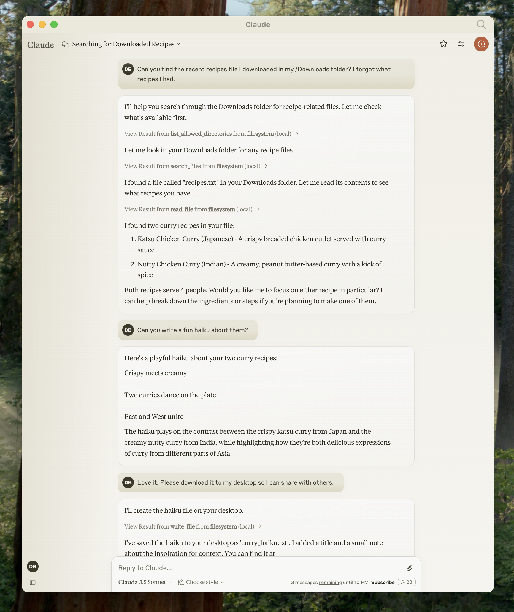
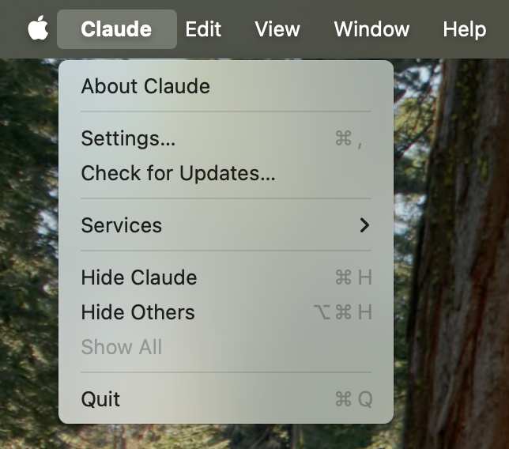

在本教程中，您将扩展 [Claude 桌面版](https://claude.ai/download)，使其能够读取计算机的文件系统、创建新文件、移动文件，甚至搜索文件。



不必担心安全性——在执行这些操作之前，都会弹出确认窗口！

## 1. 下载 Claude 桌面版

首先下载 [Claude 桌面版](https://claude.ai/download)，选择 macOS 或 Windows。（目前 Claude 桌面版尚不支持 Linux。）

按照安装说明进行操作。

如果您已经安装了 Claude 桌面版，请通过点击电脑上的 Claude 菜单并选择 `Check for updates` 确保它是最新版本。

> 为什么使用 Claude 桌面版而不是 Claude.ai？
> 因为服务器是本地运行的，MCP 目前仅支持桌面主机。远程主机正在积极开发中。

## 2. 添加文件系统 MCP 服务器

为了添加文件系统功能，我们将为 Claude 桌面版安装一个预构建的[文件系统 MCP 服务器](https://github.com/modelcontextprotocol/servers/tree/main/src/filesystem)。这是由 Anthropic 及社区创建的数十个[服务器](https://github.com/modelcontextprotocol/servers/tree/main)之一。

首先打开您电脑上的 Claude 菜单并选择 `Settings...`。请注意，这不是应用窗口本身的 Claude 帐户设置。

在 Mac 上看起来应该是这样的：



在设置栏的左侧点击 `Developer` 按钮，然后点击 `Edit Config`：


这将在以下位置创建一个配置文件：

- macOS: `~/Library/Application Support/Claude/claude_desktop_config.json`
- Windows: `%APPDATA%\Claude\claude_desktop_config.json`

如果您还没有此文件，该文件在您的文件系统中。

在任何文本编辑器中打开该配置文件。将文件内容替换为以下内容：



{}

```json
{
  "mcpServers": {
    "filesystem": {
      "command": "npx",
      "args": [
        "-y",
        "@modelcontextprotocol/server-filesystem",
        "/Users/username/Desktop",
        "/Users/username/Downloads"
      ]
    }
  }
}
```

{}
{}

```json
{
  "mcpServers": {
    "filesystem": {
      "command": "npx",
      "args": [
        "-y",
        "@modelcontextprotocol/server-filesystem",
        "C:\\Users\\username\\Desktop",
        "C:\\Users\\username\\Downloads"
      ]
    }
  }
}
```

<{}


用计算机的用户名替换代码中的 `username`。路径参数应指向您希望 Claude 能够访问和修改的有效目录。上文配置中设置了桌面和下载路径，当然也可以添加更多路径。

您还需要在电脑上安装 [Node.js](https://nodejs.org) 以使其正常运行。在命令行中验证是否已安装 Node。

- 在 macOS 上，从应用程序文件夹打开终端
- 在 Windows 上，按 Windows + R，输入 "cmd"，然后按回车键

进入命令行后，输入以下命令验证是否已安装 Node：

```bash
node --version
```

如果出现`命令未找到`或 `node 不是一个可识别的命令`的错误，请从[nodejs.org](https://nodejs.org/)下载 Node。

> 配置文件如何工作？
>
> 该配置文件告诉 Claude 桌面版每次启动应用时要启动哪些 MCP 服务器。在本例中，我们添加了一个名为 `filesystem` 的服务器，该服务器将使用 Node `npx` 命令安装并运行 `@modelcontextprotocol/server-filesystem`。此服务器的描述详见[这里](https://github.com/modelcontextprotocol/servers/tree/main/src/filesystem)，它可以让您在 Claude 桌面版中访问文件系统。
>
> **命令权限**
> Claude 桌面版将在配置文件中以您用户帐户的权限运行命令，并可以访问您的本地文件。仅在明确理解并信任来源时添加命令。

## 3. 重启 Claude

更新配置文件后，您需要重启 Claude 桌面版。

重启后，您应该会在输入框的右下角看到一个锤子图标：


点击锤子图标后，您应该会看到文件系统 MCP 服务器带来的工具：


如果 Claude 桌面版没有识别到您的服务器，请前往[故障排除](#故障排除)部分获取调试方面的指导。

## 4. 试用一下

现在您可以与 Claude 对话并咨询它有关您的文件系统的信息。它应该知道何时调用相关工具。

您可以尝试向 Claude 提问：

- 你能写一首诗并保存到我的桌面上吗？
- 我下载文件夹中有哪些与工作相关的文件？
- 你能将我桌面上的所有图片移动到一个新的“图片”文件夹中吗？

如有需要，Claude 会调用相关工具并在采取行动前征得您的许可：


## 故障排除

### 服务器未出现在 Claude 中/锤子图标缺失

  1. 完全重启 Claude 桌面版
  2. 检查您的 `claude_desktop_config.json` 文件语法
  3. 确保 `claude_desktop_config.json` 中包含的文件路径是有效的，并且是绝对路径而不是相对路径
  4. 查看日志以了解服务器未连接的原因
  5. 在命令行中手动运行服务器（与 `claude_desktop_config.json` 文件中一样替换 `username`），查看是否有任何错误：


{}

```bash
npx -y @modelcontextprotocol/server-filesystem /Users/username/Desktop /Users/username/Downloads
```

{}

{}

```powershell
npx -y @modelcontextprotocol/server-filesystem C:\Users\username\Desktop C:\Users\username\Downloads
```

{}


### 从 Claude 桌面版获取日志

与 MCP 相关的 Claude 日志文件位于：

- macOS: `~/Library/Logs/Claude`
- Windows: `%APPDATA%\Claude\logs`

- `mcp.log` 文件包含有关 MCP 连接及连接失败的一般日志。
- 文件名为 `mcp-server-SERVERNAME.log` 的日志包含来自指定服务器的错误日志（stderr）。

您可以运行以下命令列出最近的日志并跟踪新日志（在 Windows 上只能显示最近日志）：

```bash
# 检查 Claude 的日志是否有错误
tail -n 20 -f ~/Library/Logs/Claude/mcp*.log
```


{}

```bash
# Check Claude's logs for errors
tail -n 20 -f ~/Library/Logs/Claude/mcp*.log
```

{}
{}

```bash
type "%APPDATA%\Claude\logs\mcp*.log"
```

{}


### 工具调用静默失败

如果 Claude 尝试使用工具但工具失败：

1. 检查 Claude 的日志是否有错误
2. 验证您的服务器是否可以构建并运行无错误
3. 尝试重启 Claude 桌面版

### 所有步骤均无效，怎么办？

请参考我们的[调试指南](/docs/tools/debugging)，以获取更好的调试工具和更详细的指导。

### `ENOENT` 错误以及 Windows 上的`${APPDATA}`

如果配置的服务器加载失败，并且您在其日志中看到有关路径中 `${APPDATA}` 的错误，您可能需要在 `claude_desktop_config.json` 中的 `env` 键中添加 `%APPDATA%` 的展开值：

```json
{
  "brave-search": {
    "command": "npx",
    "args": ["-y", "@modelcontextprotocol/server-brave-search"],
    "env": {
      "APPDATA": "C:\\Users\\user\\AppData\\Roaming\\",
      "BRAVE_API_KEY": "..."
    }
  }
}
```

完成此修改后，再次启动 Claude 桌面版。

> **NPM 应为全局安装**
> 如果未全局安装 NPM，`npx`命令可能仍会失败。如果 NPM 已全局安装，您将找到 `%APPDATA%\npm` 存在于您的系统中。如果没有，您可以运行以下命令全局安装 NPM：

```bash
npm install -g npm
```

## 下一步

- [探索其他服务器](/docs/examples)：查看我们的官方 MCP 服务器和实现库
- [创建您自己的服务器](/docs/quickstart/server)：现在创建您自己的自定义服务器，在 Claude 桌面版及其他客户端中使用它
