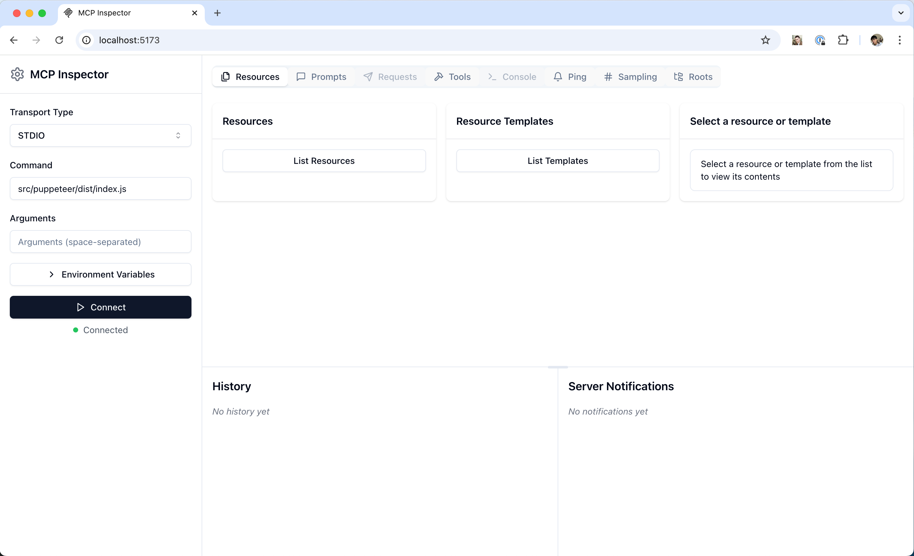

[MCP Inspector](https://github.com/modelcontextprotocol/inspector) 是一个交互式开发者工具，用于测试和调试 MCP 服务器。尽管 [调试指南](/docs/tools/debugging) 将 Inspector 作为整体调试工具包的一部分进行了介绍，但本文档会详细探讨 Inspector 的功能和能力。

## 入门指南

### 安装与基本使用

Inspector 可以直接通过 `npx` 运行，无需安装：

```bash
npx @modelcontextprotocol/inspector <command>
```

```bash
npx @modelcontextprotocol/inspector <command> <arg1> <arg2>
```

#### 检查来自 NPM 或 PyPi 的服务器

一种常见的方式是从 [NPM](https://npmjs.com) 或 [PyPi](https://pypi.com) 启动服务器包。


{}

```bash
npx -y @modelcontextprotocol/inspector npx <package-name> <args>
# 例如
npx -y @modelcontextprotocol/inspector npx server-postgres postgres://127.0.0.1/testdb
```

{}
{}

```bash
npx @modelcontextprotocol/inspector uvx <package-name> <args>
# 例如
npx @modelcontextprotocol/inspector uvx mcp-server-git --repository ~/code/mcp/servers.git
```

{}


#### 检查本地开发的服务器

要检查本地开发或下载的存储库中的服务器，最常见的方法是：


{}

```bash
npx @modelcontextprotocol/inspector node path/to/server/index.js args...
```

{}
{}

```bash
npx @modelcontextprotocol/inspector \
uv \
--directory path/to/server \
run \
package-name \
args...
```

{}


请仔细阅读附带的 README，以便获取最准确的操作说明。

## 功能概览



Inspector 提供了多种功能来与 MCP 服务器进行交互：

### 服务器连接面板

- 允许选择连接服务器的 [传输方式](/docs/concepts/transports)
- 对于本地服务器，支持自定义命令行参数和环境变量

### 资源标签页

- 列出所有可用资源
- 显示资源元数据（MIME 类型、描述）
- 支持资源内容检查
- 支持订阅测试

### 提示模板标签页

- 显示可用的提示模板
- 展示提示参数和描述
- 支持使用自定义参数进行提示测试
- 预览生成的消息

### 工具标签页

- 列出可用工具
- 展示工具架构和描述
- 支持使用自定义输入进行工具测试
- 显示工具的执行结果

### 通知面板

- 展示从服务器记录的所有日志
- 显示从服务器收到的通知

## 最佳实践

### 开发工作流程

1. 开始开发
   - 使用 Inspector 启动你的服务器
   - 验证基础连接是否正常
   - 检查能力协商

2. 迭代测试
   - 修改服务器
   - 重建服务器
   - 重新连接 Inspector
   - 测试受影响的功能
   - 监控消息

3. 测试边界情况
   - 无效输入
   - 缺失的提示参数
   - 并发操作
   - 验证错误处理和错误响应

## 下一步

- **[Inspector 仓库](https://github.com/modelcontextprotocol/inspector)**：查看 MCP Inspector 源代码
- **[调试指南](/docs/tools/debugging)**：了解更广泛的调试策略
