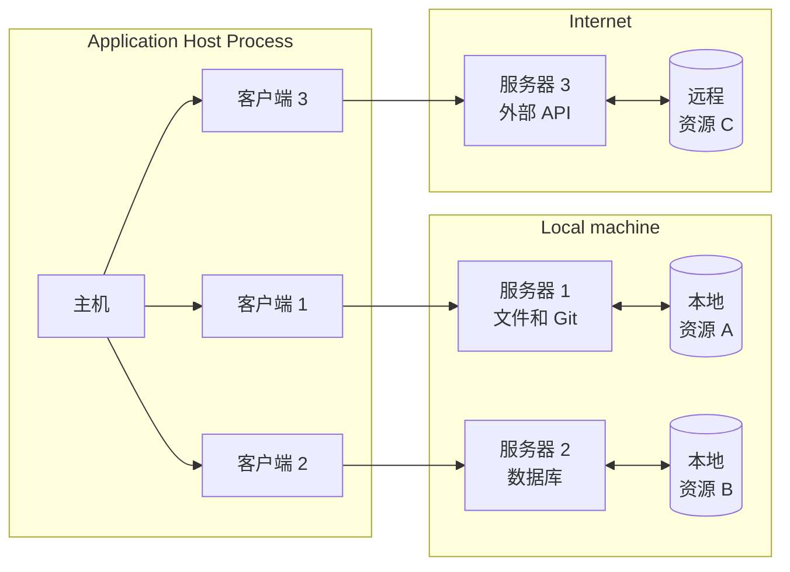
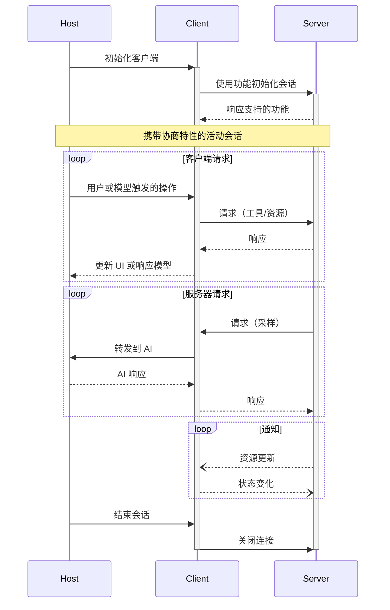

模型上下文协议（Model Context Protocol，简称 MCP）遵循客户端-主机-服务器架构，其中每个主机可以运行多种客户端实例。该架构支持用户在多个应用中集成 AI 能力，同时保持清晰的安全边界并分离职责。在 JSON-RPC 的基础上，MCP 提供了一个状态化的会话协议，专注于上下文交换和客户端与服务器之间的采样协调。

## 核心组件

### 主机

主机进程作为容器和协调者：

- 创建并管理多个客户端实例
- 控制客户端连接权限及生命周期
- 强制实施安全策略和用户授权要求
- 处理用户授权决策
- 协调 AI/LLM 集成和采样
- 管理客户端之间的上下文聚合

### 客户端

每个客户端由主机创建，并维持与服务器的隔离连接：

- 对每个服务器建立一个状态化会话
- 处理协议协商和功能交换
- 双向路由协议消息
- 管理订阅和通知
- 在服务器之间保持安全边界

主机应用创建并管理多个客户端，每个客户端与特定服务器保持 1:1 的关系。

### 服务器

服务器提供专门的上下文和功能：

- 通过 MCP 原语暴露资源、工具和 Prompt
- 独立运行以专注于特定任务
- 通过客户端接口请求采样
- 必须尊重安全约束
- 可以是本地进程或远程服务

## 设计原则

MCP 基于几个关键设计原则，这些原则决定了其架构和实现：

1. **服务器构建应该非常简单**

   - 主机应用处理复杂的协调任务
   - 服务器专注于具体且明确的功能
   - 简单的接口减少实现负担
   - 清晰的分离支持可维护的代码

2. **服务器应该具有高度的组合性**

   - 每个服务器以隔离状态提供专注功能
   - 可以无缝组合多个服务器
   - 共享协议支持互操作性
   - 模块化设计促进扩展性

3. **服务器不能读取整个会话，也不能“窥视”其他服务器**

   - 服务器仅接收必要的上下文信息
   - 完整的对话历史留存于主机进程
   - 每个服务器连接保持隔离
   - 服务器之间的交互由主机控制
   - 主机进程强制实施安全边界

4. **可以逐步向服务器和客户端添加功能**

   - 核心协议提供最低所需功能
   - 可根据需要协商附加功能
   - 服务器和客户端独立演进
   - 协议设计支持未来的扩展性
   - 保持向后兼容

## 功能协商

模型上下文协议使用基于功能的协商系统，在初始化期间，客户端和服务器显式声明其支持的功能。功能决定了在会话期间可用的协议特性和原语。

- 服务器声明功能，例如资源订阅、工具支持和提示模板
- 客户端声明功能，例如采样支持和通知处理
- 双方必须在会话期间遵守声明的功能
- 通过协议扩展可以协商附加功能

每项功能解锁会话期间的特定协议特性。例如：

- 实现的[服务器功能](/spec/server)必须在服务器功能声明中进行宣传
- 发送资源订阅通知需要服务器声明支持订阅功能
- 调用工具需要服务器声明工具功能
- [采样](/spec/client) 需要客户端在其功能中声明支持

这种功能协商保证了客户端和服务器对支持的功能有清晰的理解，同时保持协议的可扩展性。
