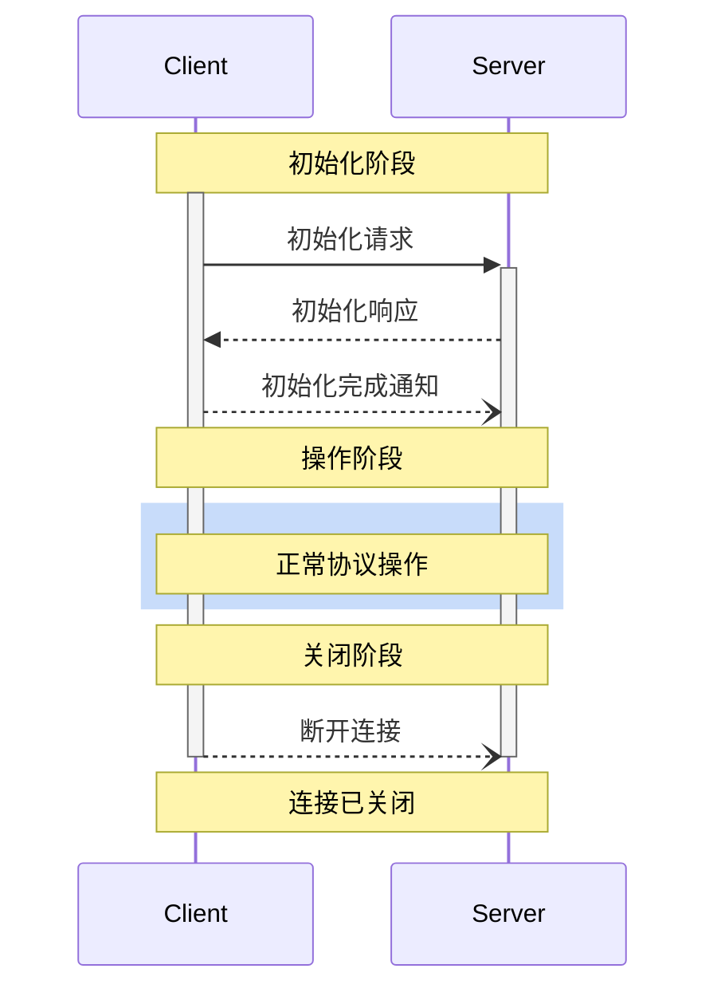

>**协议修订日期**: 2025-03-26

模型上下文协议（Model Context Protocol, MCP）定义了一个严谨的客户端-服务器连接生命周期，以确保正确的能力协商和状态管理。

1.**初始化**：能力协商和协议版本一致性确认
2.**操作**：正常协议通信
3.**关闭**：连接的优雅终止



## 生命周期阶段

### 初始化

初始化阶段**必须**是客户端和服务器的第一次交互。在此阶段，客户端和服务器：

- 确认协议版本兼容性
- 交换并协商能力
- 共享实现细节

客户端**必须**通过发送包含以下内容的 `initialize` 请求来启动此阶段：

- 支持的协议版本
- 客户端能力
- 客户端实现信息

```json
{
  "jsonrpc": "2.0",
  "id": 1,
  "method": "initialize",
  "params": {
    "protocolVersion": "2024-11-05",
    "capabilities": {
      "roots": {
        "listChanged": true
      },
      "sampling": {}
    },
    "clientInfo": {
      "name": "ExampleClient",
      "version": "1.0.0"
    }
  }
}
```

`initialize` 请求**不得**是 JSON-RPC 
[批处理](https://www.jsonrpc.org/specification#batch)的一部分，因为在完成初始化之前无法进行其他请求和通知。这也使得与先前未明确支持 JSON-RPC 批处理的协议版本的向后兼容性成为可能。

服务器**必须**响应其自身的能力和信息：

```json
{
  "jsonrpc": "2.0",
  "id": 1,
  "result": {
    "protocolVersion": "2024-11-05",
    "capabilities": {
      "logging": {},
      "prompts": {
        "listChanged": true
      },
      "resources": {
        "subscribe": true,
        "listChanged": true
      },
      "tools": {
        "listChanged": true
      }
    },
    "serverInfo": {
      "name": "ExampleServer",
      "version": "1.0.0"
    }
  }
}
```

成功初始化后，客户端**必须**发送 `initialized` 通知以表示其已准备好开始正常操作：

```json
{
  "jsonrpc": "2.0",
  "method": "notifications/initialized"
}
```

- 在服务器响应 `initialize` 请求之前，客户端**不应**发送除 
  [ping]() 请求以外的任何请求。
- 在收到 `initialized` 通知之前，服务器**不应**发送除 
  [ping]() 或
  [日志记录]()请求以外的任何请求。

#### 版本协商

在 `initialize` 请求中，客户端**必须**发送其支持的协议版本。这**应该**是客户端支持的最新版本。

如果服务器支持请求的协议版本，则**必须**响应相同版本。否则，服务器**必须**将响应的协议版本设置为其支持的另一个版本。这**应该**是服务器支持的最新版本。

如果客户端不支持服务器响应的版本，则客户端**应该**断开连接。

#### 能力协商

客户端和服务器的能力定义了会话期间协议允许的可选功能。

关键能力包括：

| 分类      | 能力          | 描述                                                                        |
| --------- | -------------- | -------------------------------------------------------------------------- |
| 客户端    | `roots`        | 提供文件系统[根目录](../client/roots)的能力                   |
| 客户端    | `sampling`     | 支持 LLM [采样](../client/sampling)请求                      |
| 客户端    | `experimental` | 描述支持非标准的实验功能                                                  |
| 服务器    | `prompts`      | 提供[提示模板](../server/prompts)                            |
| 服务器    | `resources`    | 提供可读[资源](../server/resources)                          |
| 服务器    | `tools`        | 暴露可调用的[工具](../server/tools)                          |
| 服务器    | `logging`      | 发出结构化[日志消息](../server/utilities/logging)           |
| 服务器    | `experimental` | 描述支持非标准的实验功能                                                  |

能力对象可以描述子能力，例如：

- `listChanged`: 支持列表变更通知（适用于 prompts、resources 和 tools）
- `subscribe`: 支持订阅单个项的变更（仅限 resources）

### 操作

在操作阶段，客户端和服务器根据协商好的能力交换消息。

双方**应该**：

- 遵守协商好的协议版本
- 仅使用成功协商的能力

### 关闭

在关闭阶段，一方（通常是客户端）会优雅地终止协议连接。没有定义专门的关闭消息，而是使用底层传输机制指示连接终止：

#### stdio

对于 stdio [传输](transports)，客户端**应该**通过以下方式启动关闭：

1. 首先关闭发送给子进程（即服务器）的输入流
2. 等待服务器退出，如果服务器在合理时间内未退出，则发送 `SIGTERM`
3. 如果在发送 `SIGTERM` 后服务器仍未退出，则发送 `SIGKILL`

服务器**可能**通过关闭其输出流并退出来启动关闭。

#### HTTP

对于 HTTP [传输](transports)，关闭通过终止相关的 HTTP 连接指示。

## 超时

实现**应该**为所有发送的请求设定超时，以防止连接挂起和资源耗尽。如果在超时时间内未接收到成功或错误响应，发送方**应该**为该请求发出 [取消通知](utilities/cancellation)，并停止等待响应。

SDK 和其他中间件**应该**允许这些超时在每请求的基础上进行配置。

如果收到与请求对应的 [进度通知](utilities/progress)，实现**可能**重置超时计时器，因为这表明任务正在进行。但实现**应该**始终强制执行最大超时时间，无论是否有进度通知，以限制客户端或服务器行为异常的影响。

## 错误处理

实现**应该**准备处理以下错误情况：

- 协议版本不匹配
- 未能协商所需能力
- 请求 [超时](#timeouts)

初始化错误示例：

```json
{
  "jsonrpc": "2.0",
  "id": 1,
  "error": {
    "code": -32602,
    "message": "不支持的协议版本",
    "data": {
      "supported": ["2024-11-05"],
      "requested": "1.0.0"
    }
  }
}
