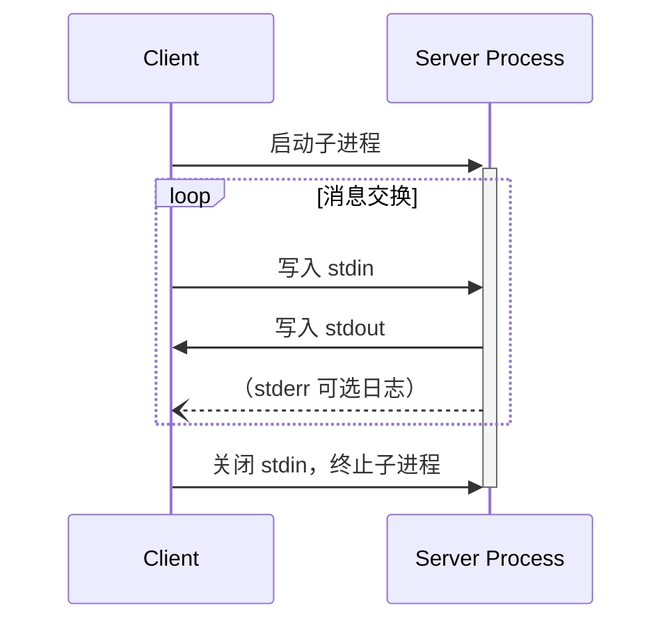
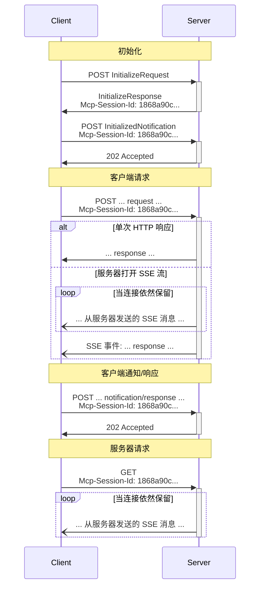

>**协议修订日期**: 2025-03-26

MCP 使用 JSON-RPC 编码消息。JSON-RPC 消息**必须**使用 UTF-8 编码。

当前协议定义了两种用于客户端与服务器通信的标准传输机制：

1. [stdio](#stdio)，通过标准输入和标准输出进行通信
2. [Streamable HTTP](#streamable-http)

客户端在可能的情况下**应当**支持 stdio。

客户端和服务器也可以以可插拔方式实现[自定义传输](#自定义传输)。

## stdio

在**stdio**传输方式中：

- 客户端以子进程形式启动 MCP 服务器。
- 服务器从其标准输入 (`stdin`) 读取 JSON-RPC 消息，并通过标准输出 (`stdout`) 发送消息。
- 消息可以是 JSON-RPC 请求、通知、响应，或者是包含一个或多个请求和/或通知的 JSON-RPC [批处理消息](https://www.jsonrpc.org/specification#batch)。
- 消息以换行符分隔，且**不得**包含嵌入的换行符。
- 服务器**可以**将 UTF-8 字符串写入其标准错误 (`stderr`) 用于记录日志。客户端**可以**捕获、转发或忽略这些日志。
- 服务器**不得**向其 `stdout` 写入无效的 MCP 消息。
- 客户端**不得**向服务器的 `stdin` 写入无效的 MCP 消息。

## Streamable HTTP

> 此传输方式替代了协议版本 2024-11-05 提出的 HTTP+SSE
传输方式。参见下文[向后兼容性](#向后兼容性) 指南。

在**Streamable HTTP**传输方式中，服务器作为能够处理多个客户端连接的独立进程运行。这种传输方式使用 HTTP POST 和 GET 请求。服务器可以选择使用
[服务器发送事件（Server-Sent Events, SSE）](https://en.wikipedia.org/wiki/Server-sent_events) 来流式发送多个服务器消息。这种方式同时支持基础功能的 MCP 服务器以及支持流式通信和从服务器向客户端发出通知与请求的更高级服务器。

服务器**必须**提供一个支持 POST 和 GET 方法的 HTTP 端点路径（以下称为**MCP 端点**）。例如，这可以是类似 `https://example.com/mcp` 的 URL。

### 向服务器发送消息

每个从客户端发送的 JSON-RPC 消息**必须**是对 MCP 端点发起的新 HTTP POST 请求。

1. 客户端**必须**使用 HTTP POST 将 JSON-RPC 消息发送到 MCP 端点。
2. 客户端**必须**包含一个 `Accept` 头，列出 `application/json` 和 `text/event-stream` 作为支持的内容类型。
3. POST 请求的请求体**必须**是以下之一：
   - 单个 JSON-RPC 请求、通知或响应
   - 一个 [批量消息](https://www.jsonrpc.org/specification#batch)，包含一个或多个请求和/或通知
   - 一个 [批量消息](https://www.jsonrpc.org/specification#batch)，包含一个或多个响应
4. 如果请求体只包含（任意数量的）JSON-RPC 响应或通知：
   - 如果服务器接受该输入，服务器**必须**返回 HTTP 状态码 `202 Accepted`，且无响应体。
   - 如果服务器无法接受该输入，服务器**必须**返回 HTTP 错误状态码（例如 `400 Bad Request`）。HTTP 响应体**可以**包含没有 `id` 的 JSON-RPC 错误响应。
5. 如果请求体包含任意数量的 JSON-RPC 请求，服务器**必须**返回以下之一：
   - 使用 `Content-Type: text/event-stream`，启动 SSE 流
   - 使用 `Content-Type: application/json`，返回一个 JSON 对象
   客户端**必须**支持以上两种情况。
6. 如果服务器启动 SSE 流：
   - SSE 流**应当**最终包含针对每个 POST 请求体中的 JSON-RPC 请求的一个 JSON-RPC 响应。这些响应**可以**是[批量消息](https://www.jsonrpc.org/specification#batch)。
   - 服务器**可以**在发送 JSON-RPC 响应之前，发送 JSON-RPC 请求和通知。这些消息**应当**与原始客户端请求相关。这些请求和通知**可以**是[批量消息](https://www.jsonrpc.org/specification#batch)。
   - 除非[会话](#会话管理) 到期，服务器**不应当**在发送完针对每个接收的 JSON-RPC 请求的 JSON-RPC 响应之前关闭 SSE 流。
   - 在发送完所有 JSON-RPC 响应后，服务器**应当**关闭 SSE 流。
   - 断开连接**可以**随时发生（例如，由于网络条件）。因此：
     - 断开连接**不应当**被解释为客户端取消请求。
     - 若要取消请求，客户端**应当**明确发送 MCP `CancelledNotification`。
     - 为避免因断开连接造成消息丢失，服务器**可以**使流支持[可恢复性](#可恢复性和重新传递)。

### 从服务器接收消息

1. 客户端**可以**向 MCP 端点发出 HTTP GET。这可用于打开 SSE 流，使服务器能够与客户端通信，而无需客户端先通过 HTTP POST 发送数据。
2. 客户端**必须**包含一个 `Accept` 头，列出 `text/event-stream` 作为支持的内容类型。
3. 服务器**必须**返回以下之一：
   - GET 请求的响应中包含 `Content-Type: text/event-stream`
   - HTTP 405 Method Not Allowed，表明服务器在此端点不支持 SSE 流。
4. 如果服务器启动 SSE 流：
   - 服务器**可以**在流中发送 JSON-RPC 请求和通知。这些请求和通知**可以**是 [批量消息](https://www.jsonrpc.org/specification#batch)。
   - 这些消息**应当**与任何并发运行的客户端 JSON-RPC 请求无关。
   - 除非 [恢复连接](#可恢复性和重新传递)，服务器**不得**在流中发送 JSON-RPC 响应。
   - 服务器**可以**随时关闭 SSE 流。
   - 客户端**可以**随时关闭 SSE 流。

### 多连接

1. 客户端**可以**同时保持与多个 SSE 流的连接。
2. 服务器**必须**仅在一个已连接的流上发送每个 JSON-RPC 消息；也就是说，服务器**不得**在多个流中广播同一条消息。
   - 为减轻消息丢失的风险，服务器**可以**使流支持 [可恢复性](#可恢复性和重新传递)。

### 可恢复性和重新传递

为了支持恢复中断的连接，以及重新传递可能丢失的消息：

1. 服务器**可以**在其 SSE 事件中附加一个 `id` 字段，如 [SSE 标准](https://html.spec.whatwg.org/multipage/server-sent-events.html#event-stream-interpretation) 所描述。
   - 如果存在，ID**必须**在同一 [会话](#会话管理) 中的所有流中全局唯一——或在未使用会话管理时，对特定客户端的所有流中全局唯一。
2. 如果客户端希望在连接中断后恢复，它**应当**向 MCP 端点发出 HTTP GET 请求，并包含 [`Last-Event-ID`](https://html.spec.whatwg.org/multipage/server-sent-events.html#the-last-event-id-header) 头，以指示其接收的最后事件 ID。
   - 服务器**可以**使用此头，在中断的流上重新发送从最后事件 ID 之后应该发送的消息，并从该点恢复流。
   - 服务器**不得**重新发送本应在不同流中交付的消息。

换句话说，这些事件 ID 应由服务器按**每流**基础分配，以充当该特定流中的光标。

### 会话管理

MCP**会话**是通过客户端与服务器之间的逻辑交互组成的，这些交互从 [初始化阶段](lifecycle) 开始。为了支持希望建立有状态会话的服务器：

1. 使用 Streamable HTTP 传输的服务器**可以**在初始化时分配会话 ID，并在包含 `InitializeResult` 的 HTTP 响应的 `Mcp-Session-Id` 头中返回。
   - 会话 ID **应当**是全局唯一且加密安全的（例如，安全生成的 UUID、JWT 或加密哈希）。
   - 会话 ID **必须**仅包含可见的 ASCII 字符（范围从 0x21 到 0x7E）。
2. 如果服务器在初始化期间返回了 `Mcp-Session-Id`，使用 Streamable HTTP 传输的客户端在后续的所有 HTTP 请求中**必须**在 `Mcp-Session-Id` 头中包含此会话 ID。
   - 需要会话 ID 的服务器**应当**在收到初始化请求以外的不含 `Mcp-Session-Id` 头的请求时，返回 HTTP 400 Bad Request。
3. 服务器**可以**随时终止会话，之后它**必须**对包含该会话 ID 的请求返回 HTTP `404 Not Found`。
4. 当客户端收到对包含 `Mcp-Session-Id` 的请求返回的 `HTTP 404` 响应时，它**必须**通过发送不含会话 ID 的新 `InitializeRequest` 开始一个新会话。
5. 不再需要特定会话的客户端（例如，因为用户离开了客户端应用）**应当**向 MCP 端点发送包含 `Mcp-Session-Id` 头的 HTTP DELETE 请求，以明确终止会话。
   - 对于此请求，服务器**可以**返回 HTTP `405 Method Not Allowed`，表明服务器不允许客户端终止会话。

### 时序图

### 向后兼容性

为了与已弃用的 HTTP+SSE 传输方式（协议版本 2024-11-05）保持向后兼容，客户端和服务器可以按以下方式操作：

**服务器**希望支持较旧的客户端时应当：

- 继续同时托管旧传输方式的 SSE 和 POST 端点，与新的 Streamable HTTP 传输定义的 “MCP 端点” 并行。
  - 也可以将旧的 POST 端点与新的 MCP 端点合并，但这可能会引入不必要的复杂性。

**客户端**希望支持较旧的服务器时应当：

1. 接受一个来自用户的 MCP 服务器 URL，该 URL 可能指向使用旧传输方式或新传输方式的服务器。
2. 尝试向服务器 URL POST 一个 `InitializeRequest`，并包含按照上述定义的 `Accept` 头：
   - 如果成功，客户端可以假定这是一个支持新 Streamable HTTP 传输方式的服务器。
   - 如果失败并返回 `HTTP 4xx` 状态码（例如 `405 Method Not Allowed` 或 `404 Not Found`）：
     - 向服务器 URL 发出 GET 请求，期望这会打开 SSE 流并返回一个 `endpoint` 事件作为第一个事件。
     - 当收到 `endpoint` 事件时，客户端可以假定这是一个运行旧 HTTP+SSE 传输方式的服务器，并应当使用该传输方式进行以后的通信。

## 自定义传输

客户端和服务器**可以**实现额外的自定义传输机制，以满足其特定的需求。协议对传输方式具有传输无关性，并且可以在支持双向消息交换的任何通信渠道上实现。

选择支持自定义传输方式的实现者**必须**确保他们保留了 MCP 所定义的 JSON-RPC 消息格式和生命周期要求。自定义传输方式**应当**文档化其特定的连接建立和消息交换模式，以帮助互操作性。
