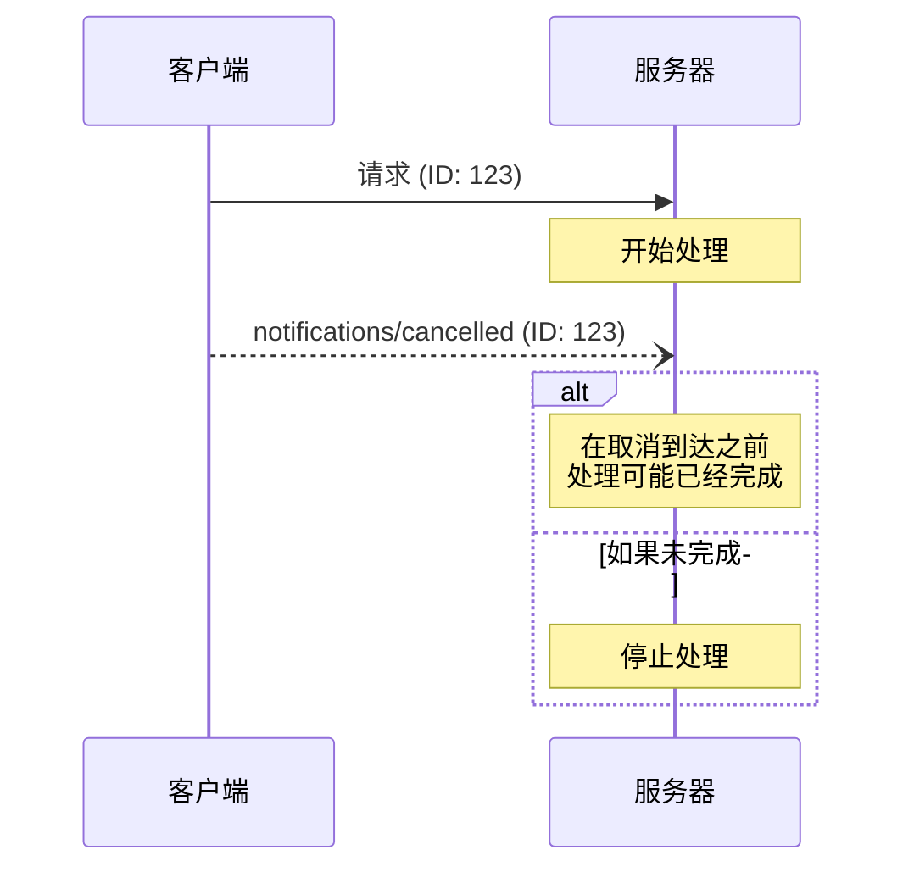

> **协议版本**: 2025-03-26

Model Context Protocol (MCP) 支持通过通知消息对进行中的请求进行可选的取消操作。任何一方都可以发送取消通知，指示终止之前发出的请求。

## 取消流程

当某一方希望取消进行中的请求时，它会发送一个 `notifications/cancelled` 通知，其中包含以下信息：

- 要取消的请求的 ID
- 可选的原因字符串，用于记录或显示

```json
{
  "jsonrpc": "2.0",
  "method": "notifications/cancelled",
  "params": {
    "requestId": "123",
    "reason": "用户请求取消"
  }
}
```

## 行为要求

1. 取消通知**必须（MUST）**仅引用以下请求：
   - 之前同一方向发出的请求
   - 被认为仍处于进行中的请求
2. 客户端**不得（MUST NOT）**取消 `initialize` 请求。
3. 取消通知的接收方**应该（SHOULD）**：
   - 停止处理被取消的请求
   - 释放相关资源
   - 不发送被取消请求的响应
4. 取消通知的接收方**可以（MAY）**忽略取消通知，若：
   - 引用的请求是未知的
   - 请求的处理已经完成
   - 请求无法被取消
5. 取消通知的发送方**应该（SHOULD）**忽略之后收到的该请求的响应。

## 时间考虑

由于网络延迟，取消通知可能会在请求处理完成后到达，并且可能是在响应已经发送之后。

双方**必须（MUST）**优雅地处理这些竞争条件：



## 实现注意事项

- 双方**应该（SHOULD）**记录取消原因以便调试
- 应用程序的用户界面**应该（SHOULD）**指明请求已被取消

## 错误处理

对于无效的取消通知**应该(SHOULD）**被忽略：

- 未知的请求 ID
- 已经完成的请求
- 格式错误的通知

这保持了通知的“发送即忘”特性，同时允许在异步通信中处理竞争条件。
