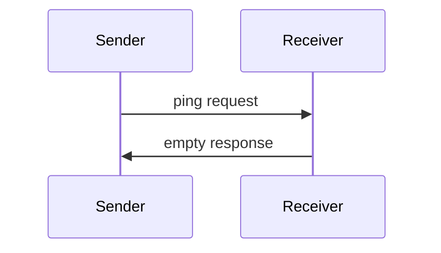

> **协议修订**: 2025-03-26

Model Context Protocol 包括一个可选的 ping 机制，允许任意一方验证其对方是否仍然响应并保持连接。

## 概览

Ping 功能通过一个简单的请求/响应模式实现。客户端或服务器均可通过发送 `ping` 请求发起一次 ping 操作。

## 消息格式

Ping 请求是一个没有参数的标准 JSON-RPC 请求：

```json
{
  "jsonrpc": "2.0",
  "id": "123",
  "method": "ping"
}
```

## 行为要求

1. 接收方**必须**及时以一个空响应进行回复：

    ```json
    {
      "jsonrpc": "2.0",
      "id": "123",
      "result": {}
    }
    ```

2. 如果在合理的超时时间内未收到回复，发送方**可以**：

   - 认为连接已失效
   - 终止连接
   - 尝试重新连接

## 使用模式



## 实现注意事项

- 实现**应该**定期发起 ping，以检测连接的健康状况
- Ping 的频率**应该**是可配置的
- 超时时间**应该**适应网络环境
- **应该**避免过度发送 ping，以减少网络开销

## 错误处理

- 超时**应该**被视为连接失败
- 多次 ping 失败**可以**触发连接重置
- 实现**应该**记录 ping 失败以便诊断
