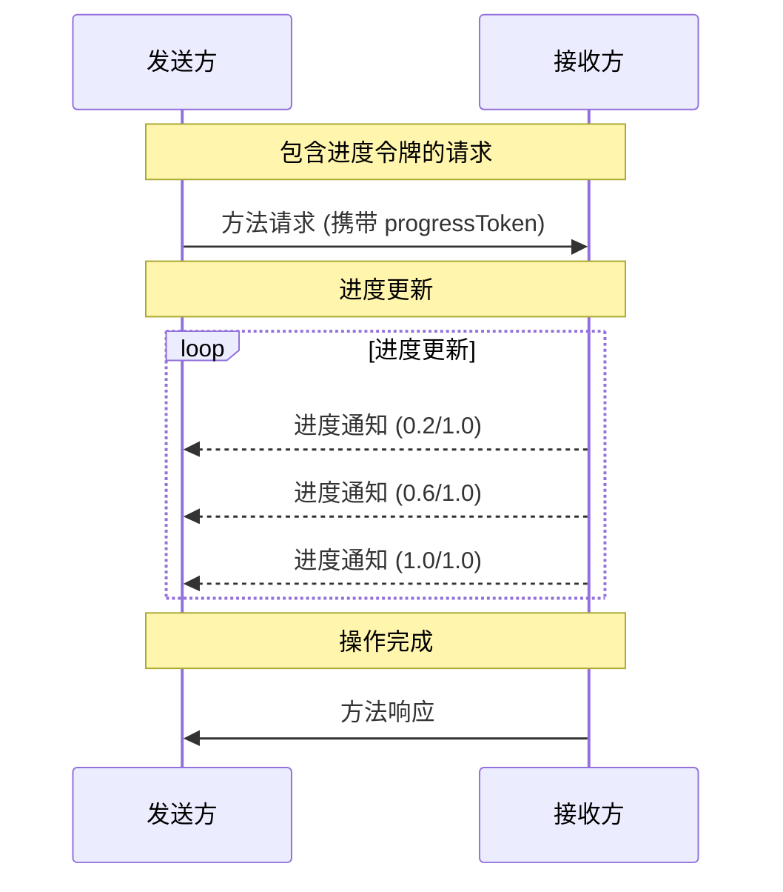

> **协议修订**: 2025-03-26

Model Context Protocol (MCP) 支持通过通知消息对长时间运行的操作进行可选的进度跟踪。任意一方都可以发送进度通知来提供操作状态的更新。

## 进度流程

当一方希望为请求**接收**进度更新时，它需要在请求的元数据中包含一个 `progressToken`。

- 进度令牌（progress token）**必须**是字符串或整数类型。
- 进度令牌可以由发送方通过任意方式选择，但**必须**在所有活跃请求中唯一。

```json
{
  "jsonrpc": "2.0",
  "id": 1,
  "method": "some_method",
  "params": {
    "_meta": {
      "progressToken": "abc123"
    }
  }
}
```

接收方**可以**发送进度通知，通知中应包含以下内容：

- 原始的进度令牌
- 当前已完成的进度值
- 可选的 "total"（总进度）值
- 可选的 "message"（消息）值

```json
{
  "jsonrpc": "2.0",
  "method": "notifications/progress",
  "params": {
    "progressToken": "abc123",
    "progress": 50,
    "total": 100,
    "message": "正在拉伸样条曲线..."
  }
}
```

- `progress` 值**必须**在每次通知中递增，即使 `total` 值未知。
- `progress` 和 `total` 值**可以**为浮点数。
- `message` 字段**应**提供相关的、可读的人类进度信息。

## 行为要求

1. 进度通知 **必须** 仅引用以下令牌：
   - 在活跃请求中提供的令牌
   - 与当前正在进行的操作相关联的令牌

2. 接收进度请求的一方**可以**：
   - 选择不发送任何进度通知
   - 以其认为适当的频率发送通知
   - 如果总进度未知，可以省略 `total` 值



## 实现注意事项

- 发送方和接收方**应**跟踪活跃的进度令牌。
- 双方**应**实现速率限制，以防止消息泛滥。
- 操作完成后，进度通知**必须**停止。
