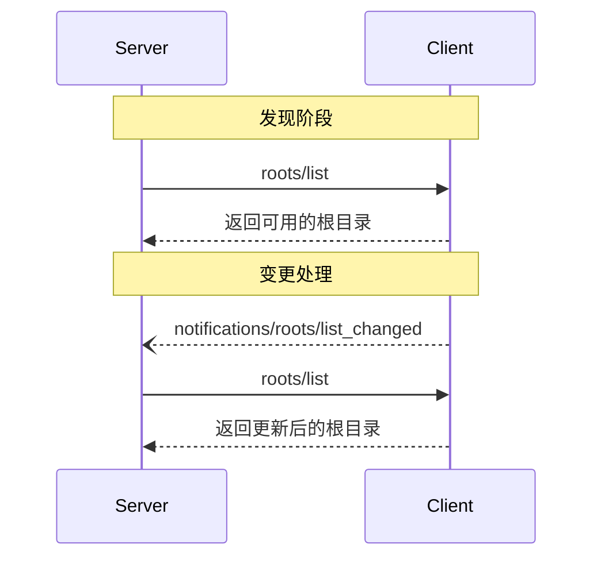

> **协议修订**: 2025-03-26

模型上下文协议（Model Context Protocol，简称 MCP）提供了一种标准化方式，允许客户端将文件系统中的“根目录”（roots）暴露给服务器。根目录定义了服务器在文件系统中可以操作的范围，帮助其了解可以访问的目录和文件。服务器可以从支持的客户端请求根目录列表，并在列表发生变化时接收通知。

## 用户交互模型

在 MCP 中，根目录通常通过工作区或项目配置界面暴露。

例如，可以实现一个工作区/项目选择器，允许用户选择服务器可以访问的目录和文件。这种方式可以与版本控制系统或项目文件的自动工作区检测相结合。

然而，具体实现可以通过任何适合需求的交互模式暴露根目录&mdash;协议本身并未要求特定的用户交互模型。

## 功能

支持根目录的客户端在[初始化](/spec/basic/lifecycle#initialization)时**必须**声明其 `roots` 能力：

```json
{
  "capabilities": {
    "roots": {
      "listChanged": true
    }
  }
}
```

`listChanged` 表示客户端是否会在根目录列表更改时发出通知。

## 协议消息

### 列出根目录

服务器发送 `roots/list` 请求以检索根目录列表：

**请求:**

```json
{
  "jsonrpc": "2.0",
  "id": 1,
  "method": "roots/list"
}
```

**响应:**

```json
{
  "jsonrpc": "2.0",
  "id": 1,
  "result": {
    "roots": [
      {
        "uri": "file:///home/user/projects/myproject",
        "name": "My Project"
      }
    ]
  }
}
```

### 根目录列表变更

当根目录发生变化时，支持 `listChanged` 的客户端**必须**发送通知：

```json
{
  "jsonrpc": "2.0",
  "method": "notifications/roots/list_changed"
}
```

## 消息流程



## 数据类型

### Root

根目录定义包括以下内容：

- `uri`: 根目录的唯一标识符。在当前规范中，这**必须**是一个 `file://` URI。
- `name`: 可选项，用于显示的易读名称。

针对不同场景的根目录示例：

#### 项目目录

```json
{
  "uri": "file:///home/user/projects/myproject",
  "name": "My Project"
}
```

#### 多个代码库

```json
[
  {
    "uri": "file:///home/user/repos/frontend",
    "name": "Frontend Repository"
  },
  {
    "uri": "file:///home/user/repos/backend",
    "name": "Backend Repository"
  }
]
```

## 错误处理

针对常见故障情况，客户端应返回标准 JSON-RPC 错误：

- 客户端不支持根目录: `-32601` (方法未找到)
- 内部错误: `-32603`

错误示例：

```json
{
  "jsonrpc": "2.0",
  "id": 1,
  "error": {
    "code": -32601,
    "message": "Roots not supported",
    "data": {
      "reason": "Client does not have roots capability"
    }
  }
}
```

## 安全性考虑

1. 客户端**必须**:

   - 仅暴露具有适当权限的根目录
   - 验证所有根目录 URI，以防止路径遍历攻击
   - 实现适当的访问控制
   - 监控根目录的可访问性

2. 服务器**应当**:
   - 处理根目录不可用的情况
   - 在操作过程中遵守根目录界限
   - 验证所有路径是否符合提供的根目录

## 实现指南

1. 客户端**应当**:

   - 在暴露根目录给服务器之前获得用户同意
   - 提供清晰的用户界面来管理根目录
   - 在暴露之前验证根目录的可访问性
   - 监控根目录的变更

2. 服务器**应当**:
   - 在使用之前检查客户端是否支持根目录能力
   - 优雅地处理根目录列表变化
   - 在操作中遵循根目录界限
   - 适当地缓存根目录信息
