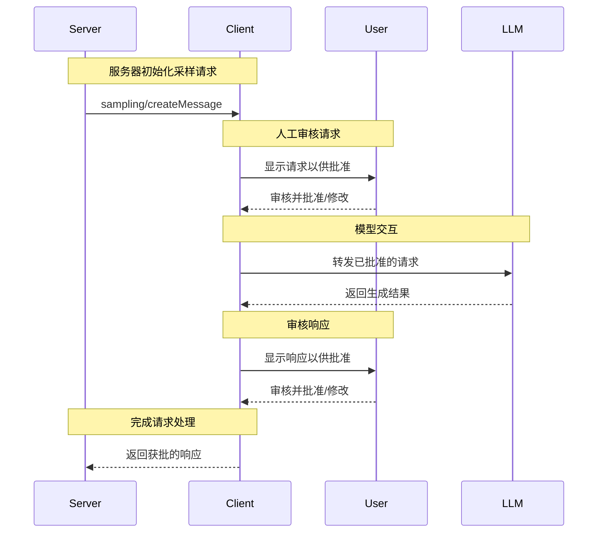

> **协议修订日期**: 2025-03-26

模型上下文协议 (MCP) 提供了一种标准化方式，允许服务器通过客户端请求语言模型的采样（“补全”或“生成”）。此流程让客户端能够控制模型访问、选择和权限，同时使服务器无需服务器API密钥即可利用AI能力。服务器可以请求基于文本、音频或图像的交互，并可以选择在提示中包含来自MCP服务器的上下文。

## 用户交互模型

MCP中的采样允许服务器实现代理行为，通过支持 LLM 调用嵌套在其他MCP服务器功能中。

实现可以根据需要通过任意接口模式提供采样功能&mdash;协议本身并不强制指定任何特定的用户交互模型。

> 出于信任、安全和保障，采样请求**应该**始终有一个人工审核环节，可以拒绝采样请求。

应用程序**应该**：

- 提供易于且直观的用户界面以审查采样请求
- 允许用户在发送之前查看和编辑提示
- 在交付之前审核生成的响应

## 功能

支持采样的客户端**必须**在[初始化](../basic/lifecycle#initialization)期间声明 `sampling` 功能：

```json
{
  "capabilities": {
    "sampling": {}
  }
}
```

## 协议消息

### 创建消息

服务器发送 `sampling/createMessage` 请求以请求语言模型生成：

**请求:**

```json
{
  "jsonrpc": "2.0",
  "id": 1,
  "method": "sampling/createMessage",
  "params": {
    "messages": [
      {
        "role": "user",
        "content": {
          "type": "text",
          "text": "法国的首都是什么？"
        }
      }
    ],
    "modelPreferences": {
      "hints": [
        {
          "name": "claude-3-sonnet"
        }
      ],
      "intelligencePriority": 0.8,
      "speedPriority": 0.5
    },
    "systemPrompt": "你是一个乐于助人的助手。",
    "maxTokens": 100
  }
}
```

**响应:**

```json
{
  "jsonrpc": "2.0",
  "id": 1,
  "result": {
    "role": "assistant",
    "content": {
      "type": "text",
      "text": "法国的首都是巴黎。"
    },
    "model": "claude-3-sonnet-20240307",
    "stopReason": "endTurn"
  }
}
```

## 消息流程



## 数据类型

### 消息

采样消息可以包含：

#### 文本内容

```json
{
  "type": "text",
  "text": "消息内容"
}
```

#### 图像内容

```json
{
  "type": "image",
  "data": "base64 编码图像数据",
  "mimeType": "image/jpeg"
}
```

#### 音频内容

```json
{
  "type": "audio",
  "data": "base64 编码音频数据",
  "mimeType": "audio/wav"
}
```

### 模型偏好

MCP中的模型选择需要谨慎抽象，因为服务器和客户端可能使用不同的AI供应商且模型提供不同。服务器不能简单地通过名称请求特定模型，因为客户端可能无法访问该模型或更倾向于使用具有类似功能的其他供应商的模型。

为解决此问题，MCP利用偏好系统，将抽象能力优先级与可选模型提示结合起来：

#### 能力优先级

服务器通过三个归一化优先级值（0-1）表达需求：

- `costPriority`: 降低成本有多重要？值越高，越倾向于选择廉价模型。
- `speedPriority`: 低延迟有多重要？值越高，越倾向于选择快速模型。
- `intelligencePriority`: 高级功能有多重要？值越高，越倾向于选择能力更强的模型。

#### 模型提示

优先级通过特性选择模型，而 `hints` 允许服务器建议具体模型或模型系列：

- 提示作为字符串片段灵活匹配模型名称
- 提示按偏好顺序依次评估
- 客户端**可以**将提示映射到其他供应商的同等模型
- 提示仅为建议&mdash;最终模型选择由客户端决定

例如:

```json
{
  "hints": [
    { "name": "claude-3-sonnet" }, // 更倾向于Sonnet类模型
    { "name": "claude" } // 回退到任何Claude模型
  ],
  "costPriority": 0.3, // 成本需求较低
  "speedPriority": 0.8, // 更注重速度
  "intelligencePriority": 0.5 // 中等能力需求
}
```

客户端处理这些偏好以从其可用选项中选择适当模型。例如，如果客户端没有访问Claude 模型但拥有 Gemini，则可以将 Sonnet 提示映射到 `gemini-1.5-pro`，因为其功能相似。

## 错误处理

客户端**应该**针对常见故障情况返回错误：

错误示例：

```json
{
  "jsonrpc": "2.0",
  "id": 1,
  "error": {
    "code": -1,
    "message": "用户拒绝采样请求"
  }
}
```

## 安全考虑

1. 客户端**应该**实现用户批准控制
2. 双方**应该**验证消息内容
3. 客户端**应该**尊重模型偏好提示
4. 客户端**应该**实施速率限制
5. 双方**必须**妥善处理敏感数据
