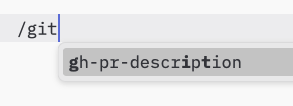

> **协议修订版本**: 2025-03-26

模型上下文协议（Model Context Protocol, MCP）提供一种标准化的方法，让服务器向客户端公开提示模板。提示允许服务器提供与语言模型互动的结构化消息和指令。客户端可以发现可用的提示，检索其内容，并提供参数进行个性化定制。

## 用户交互模型

提示设计为**用户可控制**，意思是它们从服务器暴露给客户端，以便用户能够明确选择并使用这些提示。

通常情况下，可以通过用户界面中的用户发起的命令来触发提示，这允许用户自然地发现并调用可用的提示。

例如，可以通过斜杠命令触发提示：



然而，开发者可以自由地选择任何适合自己需求的界面模式来暴露提示&mdash;协议本身并未规定任何具体的交互模型。

## 功能

支持提示的服务器**必须**在[初始化](/spec/basic/lifecycle#initialization)期间声明 `prompts` 功能：

```json
{ "capabilities": { "prompts": { "listChanged": true } } }
```

`listChanged` 表示服务器是否会在可用提示列表发生变化时发送通知。

## 协议消息

### 列出提示

为了检索可用提示，客户端发送 `prompts/list` 请求。此操作支持[分页](utilities/pagination)。

**请求：**

```json
{
  "jsonrpc": "2.0",
  "id": 1,
  "method": "prompts/list",
  "params": {
    "cursor": "optional-cursor-value"
  }
}
```

**响应：**

```json
{
  "jsonrpc": "2.0",
  "id": 1,
  "result": {
    "prompts": [
      {
        "name": "code_review",
        "description": "请求LLM分析代码质量并提出改进建议",
        "arguments": [
          {
            "name": "code",
            "description": "需要审查的代码",
            "required": true
          }
        ]
      }
    ],
    "nextCursor": "next-page-cursor"
  }
}
```

### 获取提示

为了检索特定提示，客户端发送 `prompts/get` 请求。参数可以通过 [Completion API](utilities/completion") 进行自动补全。

**请求：**

```json
{
  "jsonrpc": "2.0",
  "id": 2,
  "method": "prompts/get",
  "params": {
    "name": "code_review",
    "arguments": {
      "code": "def hello():\n    print('world')"
    }
  }
}
```

**响应：**

```json
{
  "jsonrpc": "2.0",
  "id": 2,
  "result": {
    "description": "代码审查提示",
    "messages": [
      {
        "role": "user",
        "content": {
          "type": "text",
          "text": "请审查以下Python代码：\ndef hello():\n    print('world')"
        }
      }
    ]
  }
}
```

### 列表变更通知

当可用提示列表发生变化时，声明了 `listChanged` 功能的服务器**应**发送通知：

```json
{
  "jsonrpc": "2.0",
  "method": "notifications/prompts/list_changed"
}
```

## 消息流程


## 数据类型

### 提示 (Prompt)

一个提示定义包括：

- `name`：提示的唯一标识符
- `description`：可选的人类可读描述
- `arguments`：可选的用于定制化提示参数的列表

### 提示消息 (PromptMessage)

提示中的消息可以包含：

- `role`：指示发言者，可以是 "user" 或 "assistant"
- `content`：以下内容类型之一：

#### 文本内容 (Text Content)

文本内容表示纯文本消息：

```json
{
  "type": "text",
  "text": "消息的文本内容"
}
```

这是自然语言交互中最常用的内容类型。

#### 图像内容 (Image Content)

图像内容允许在消息中包含视觉信息：

```json
{
  "type": "image",
  "data": "base64-encoded-image-data",
  "mimeType": "image/png"
}
```

图像数据**必须**经过 Base64 编码并包含有效的 MIME 类型。这支持在需要视觉上下文的情况下进行多模态交互。

#### 音频内容 (Audio Content)

音频内容允许在消息中包含音频信息：

```json
{
  "type": "audio",
  "data": "base64-encoded-audio-data",
  "mimeType": "audio/wav"
}
```

音频数据**必须**经过 Base64 编码并包含有效的MIME类型。这支持在需要音频上下文的情况下进行多模态交互。

#### 嵌入资源 (Embedded Resources)

嵌入资源允许直接在消息中引用服务器端资源：

```json
{
  "type": "resource",
  "resource": {
    "uri": "resource://example",
    "mimeType": "text/plain",
    "text": "资源内容"
  }
}
```

资源可以包含纯文本或二进制（Blob）数据，**必须**包括：

- 有效的资源 URI
- 适当的 MIME 类型
- 文本内容或 Base64 编码的 Blob 数据

嵌入资源使得提示能够无缝整合服务器管理的内容，例如文档、代码示例或其他参考资料，直接嵌入到对话流程中。

## 错误处理

服务器**应**为常见故障情况返回标准JSON-RPC错误：

- 无效的提示名称：`-32602` (参数无效)
- 缺少必需的参数：`-32602` (参数无效)
- 内部错误：`-32603` (内部错误)

## 实现考量

1. 服务器**应**在处理之前验证提示参数。
2. 客户端**应**处理大型提示列表的分页。
3. 双方**应**遵守功能协商规定。

## 安全性

实现**必须**仔细验证所有提示输入和输出，以防止注入攻击或未经授权访问资源。
