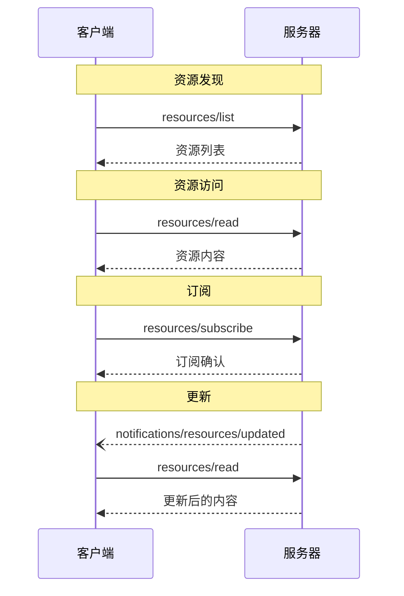

> **协议修订**: 2025-03-26

Model Context Protocol (MCP) 提供了一种标准化方法，让服务器能向客户端公开资源。资源允许服务器共享提供语言模型上下文的数据，例如文件、数据库架构或应用程序特定的信息。每个资源通过唯一的 [URI](https://datatracker.ietf.org/doc/html/rfc3986) 进行标识。

## 用户交互模型

MCP 中的资源设计为**应用驱动**，由主机应用程序决定如何根据需求整合上下文。

例如，应用程序可以：

- 通过 UI 元素公开资源，允许用户在树状或列表视图中进行显式选择
- 允许用户搜索和过滤可用资源
- 基于启发式方法或 AI 模型的选择，实现自动上下文整合


然而，具体实现可以根据需要通过任何界面模式公开资源——协议本身并未强制规定用户交互模型。

## 功能

支持资源的服务器 **必须（MUST）** 声明 `resources` 功能：

```json
{
  "capabilities": {
    "resources": {
      "subscribe": true,
      "listChanged": true
    }
  }
}
```

该功能支持两个可选特性：

- `subscribe`：客户端是否可以订阅以接收关于单个资源变更的通知。
- `listChanged`：服务器是否会发送通知，当可用资源列表发生变化时。

`subscribe` 和 `listChanged` 都是可选的——服务器可以选择不支持任何功能、支持其中一个或同时支持：

```json
{
  "capabilities": {
    "resources": {} // 不支持任何特性
  }
}
```

```json
{
  "capabilities": {
    "resources": {
      "subscribe": true // 仅支持订阅
    }
  }
}
```

```json
{
  "capabilities": {
    "resources": {
      "listChanged": true // 仅支持列表变更通知
    }
  }
}
```

## 协议消息

### 资源列表

为了发现可用资源，客户端发送 `resources/list` 请求。此操作支持 [分页]()。

**请求:**

```json
{
  "jsonrpc": "2.0",
  "id": 1,
  "method": "resources/list",
  "params": {
    "cursor": "optional-cursor-value"
  }
}
```

**响应:**

```json
{
  "jsonrpc": "2.0",
  "id": 1,
  "result": {
    "resources": [
      {
        "uri": "file:///project/src/main.rs",
        "name": "main.rs",
        "description": "主应用程序入口点",
        "mimeType": "text/x-rust"
      }
    ],
    "nextCursor": "next-page-cursor"
  }
}
```

### 读取资源

为了检索资源内容，客户端发送 `resources/read` 请求：

**请求:**

```json
{
  "jsonrpc": "2.0",
  "id": 2,
  "method": "resources/read",
  "params": {
    "uri": "file:///project/src/main.rs"
  }
}
```

**响应:**

```json
{
  "jsonrpc": "2.0",
  "id": 2,
  "result": {
    "contents": [
      {
        "uri": "file:///project/src/main.rs",
        "mimeType": "text/x-rust",
        "text": "fn main() {\n    println!(\"Hello world!\");\n}"
      }
    ]
  }
}
```

### 资源模板

资源模板允许服务器使用 [URI 模板](https://datatracker.ietf.org/doc/html/rfc6570)公开参数化资源。参数可以通过 [completion API](utilities/completion) 自动补全。

**请求:**

```json
{
  "jsonrpc": "2.0",
  "id": 3,
  "method": "resources/templates/list"
}
```

**响应:**

```json
{
  "jsonrpc": "2.0",
  "id": 3,
  "result": {
    "resourceTemplates": [
      {
        "uriTemplate": "file:///{path}",
        "name": "项目文件",
        "description": "访问项目目录中的文件",
        "mimeType": "application/octet-stream"
      }
    ]
  }
}
```

### 列表变更通知

当可用资源列表发生变化时，声明了 `listChanged` 功能的服务器 **应该（SHOULD）** 发送通知：

```json
{
  "jsonrpc": "2.0",
  "method": "notifications/resources/list_changed"
}
```

### 订阅

协议支持资源变更的可选订阅。客户端可以订阅特定资源并在资源发生变更时接收通知：

**订阅请求:**

```json
{
  "jsonrpc": "2.0",
  "id": 4,
  "method": "resources/subscribe",
  "params": {
    "uri": "file:///project/src/main.rs"
  }
}
```

**更新通知:**

```json
{
  "jsonrpc": "2.0",
  "method": "notifications/resources/updated",
  "params": {
    "uri": "file:///project/src/main.rs"
  }
}
```

## 消息流



## 数据类型

### 资源

资源定义包括：

- `uri`：资源的唯一标识符
- `name`：人类可读的名称
- `description`：可选描述
- `mimeType`：可选 MIME 类型
- `size`：可选字节大小

### 资源内容

资源可以包含文本或二进制数据：

#### 文本内容

```json
{
  "uri": "file:///example.txt",
  "mimeType": "text/plain",
  "text": "资源内容"
}
```

#### 二进制内容

```json
{
  "uri": "file:///example.png",
  "mimeType": "image/png",
  "blob": "base64-encoded-data"
}
```

## 常用 URI 方案

协议定义了几个标准的 URI 方案。这些方案不是详尽无遗的&mdash;实现始终可以使用额外的自定义 URI 方案。

### https://

用于表示在网上可用的资源。

服务器 **应该（SHOULD）** 仅在客户端能够直接从网络上自由获取并加载资源，而无需通过 MCP 服务器读取资源时才使用此方案。

对于其他使用场景，即便服务器会通过互联网下载资源内容，服务器 **应该（SHOULD）** 优先使用其他 URI 方案或定义自定义方案。

### file://

用于标识表现类似文件系统的资源。然而，这些资源不一定映射到实际的物理文件系统。

MCP 服务器 **可以（MAY）** 使用 [XDG MIME 类型](https://specifications.freedesktop.org/shared-mime-info-spec/0.14/ar01s02.html#id-1.3.14)，比如 `inode/directory`，来表示非普通文件（如目录），这些文件没有其他标准的 MIME 类型。

### git://

Git 版本控制集成。

## 错误处理

服务器 **应该（SHOULD）** 返回标准 JSON-RPC 错误以处理常见故障情况：

- 资源未找到：`-32002`
- 内部错误：`-32603`

错误示例：

```json
{
  "jsonrpc": "2.0",
  "id": 5,
  "error": {
    "code": -32002,
    "message": "资源未找到",
    "data": {
      "uri": "file:///nonexistent.txt"
    }
  }
}
```

## 安全性考虑

1. 服务器 **必须（MUST）** 验证所有资源的 URI
2. 应为敏感资源实施访问控制 **应该（SHOULD）**
3. 二进制数据 **必须（MUST）** 正确编码
4. 在操作之前，应检查资源权限 **应该（SHOULD）**
