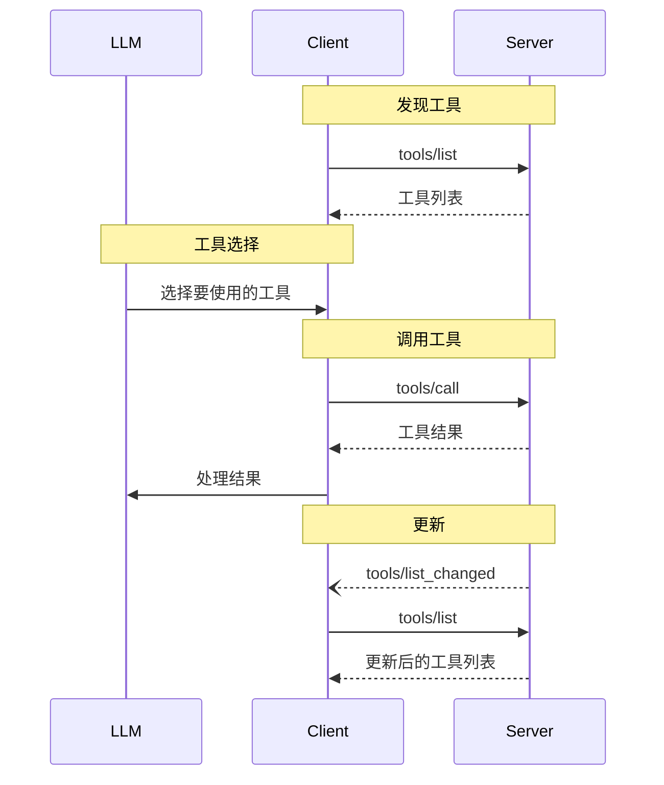

~~~markdown
---
title: 工具
type: docs
weight: 40
---

> **协议修订**: 2025-03-26

Model Context Protocol（MCP，模型上下文协议）允许服务器向语言模型暴露可调用的工具。工具使模型能够与外部系统交互，如查询数据库、调用API或执行计算。每个工具都有一个唯一标识名称，并附带描述其结构的元数据。

## 用户交互模型

MCP中的工具设计为**模型控制**的，意味着语言模型可以根据上下文理解和用户的提示自动发现并调用工具。

不过，具体实现可以通过任何满足需求的接口模式来暴露工具&mdash;协议本身并不强制规定任何特定的用户交互模型。

> 从信任、安全和安全性角度考虑，始终应当有一个人在环以便能够拒绝工具调用。

应用**应该**：

- 提供清晰的用户界面，表明哪些工具对AI模型是可用的
- 提供明确的视觉标识，说明工具何时被调用
- 在操作前向用户展示确认提示，确保有一个人在环

## 功能

支持工具的服务器**必须**声明 `tools` 功能：

```json
{
  "capabilities": {
    "tools": {
      "listChanged": true
    }
  }
}
```

`listChanged` 指示服务器是否会在可用工具列表发生更改时发送通知。

## 协议信息

### 列出工具

为了发现可用工具，客户端需要发送 `tools/list` 请求。此操作支持[分页](utilities/pagination)。

**请求：**

```json
{
  "jsonrpc": "2.0",
  "id": 1,
  "method": "tools/list",
  "params": {
    "cursor": "optional-cursor-value"
  }
}
```

**响应：**

```json
{
  "jsonrpc": "2.0",
  "id": 1,
  "result": {
    "tools": [
      {
        "name": "get_weather",
        "description": "获取某地的当前天气信息",
        "inputSchema": {
          "type": "object",
          "properties": {
            "location": {
              "type": "string",
              "description": "城市名称或邮政编码"
            }
          },
          "required": ["location"]
        }
      }
    ],
    "nextCursor": "next-page-cursor"
  }
}
```

### 调用工具

为了调用某个工具，客户端需要发送 `tools/call` 请求：

**请求：**

```json
{
  "jsonrpc": "2.0",
  "id": 2,
  "method": "tools/call",
  "params": {
    "name": "get_weather",
    "arguments": {
      "location": "New York"
    }
  }
}
```

**响应：**

```json
{
  "jsonrpc": "2.0",
  "id": 2,
  "result": {
    "content": [
      {
        "type": "text",
        "text": "纽约当前天气：\n温度：72°F\n状况：局部多云"
      }
    ],
    "isError": false
  }
}
```

### 列表变更通知

当可用工具列表发生更改时，声明了 `listChanged` 功能的服务器**应当**发送通知：

```json
{
  "jsonrpc": "2.0",
  "method": "notifications/tools/list_changed"
}
```

## 消息流



## 数据类型

### 工具

一个工具定义包括：

- `name`：工具的唯一标识符
- `description`：描述功能的可读文字
- `inputSchema`：定义预期参数的JSON Schema
- `annotations`：描述工具行为的可选属性

出于信任与安全考虑，客户端**必须**将工具注释视为不可信，除非它们来自可信服务器。 

### 工具结果

工具结果可以包含多种类型的内容项：

#### 文本内容

```json
{
  "type": "text",
  "text": "工具结果文本"
}
```

#### 图片内容

```json
{
  "type": "image",
  "data": "base64-编码的数据",
  "mimeType": "image/png"
}
```

#### 音频内容

```json
{
  "type": "audio",
  "data": "base64-编码的音频数据",
  "mimeType": "audio/wav"
}
```

#### 嵌入资源

[资源]() **可以**被嵌入，以提供附加上下文或数据，并通过一个客户端稍后可以订阅或检索的URI表示：

```json
{
  "type": "resource",
  "resource": {
    "uri": "resource://example",
    "mimeType": "text/plain",
    "text": "资源内容"
  }
}
```

## 错误处理

工具使用两种错误报告机制：

1. **协议信息错误**：针对以下问题的标准 JSON-RPC 错误：

   - 未知工具
   - 无效参数
   - 服务器错误

2. **工具执行错误**：在工具结果中通过 `isError: true` 报告：
   - API 失败
   - 无效输入数据
   - 业务逻辑错误

协议信息错误示例：

```json
{
  "jsonrpc": "2.0",
  "id": 3,
  "error": {
    "code": -32602,
    "message": "未知工具：invalid_tool_name"
  }
}
```

工具执行错误示例：

```json
{
  "jsonrpc": "2.0",
  "id": 4,
  "result": {
    "content": [
      {
        "type": "text",
        "text": "获取天气数据失败：API速率超限"
      }
    ],
    "isError": true
  }
}
```

## 安全考量

1. 服务器**必须**：

   - 验证所有工具输入
   - 实现适当的访问控制
   - 对工具调用进行速率限制
   - 对工具输出进行清理

2. 客户端**应当**：

   - 对敏感操作提示用户确认
   - 在调用服务器前向用户显示工具输入，以避免恶意或意外的数据泄露
   - 验证工具结果后再传递给LLM
   - 对工具调用设置超时
   - 记录工具使用以备审计
