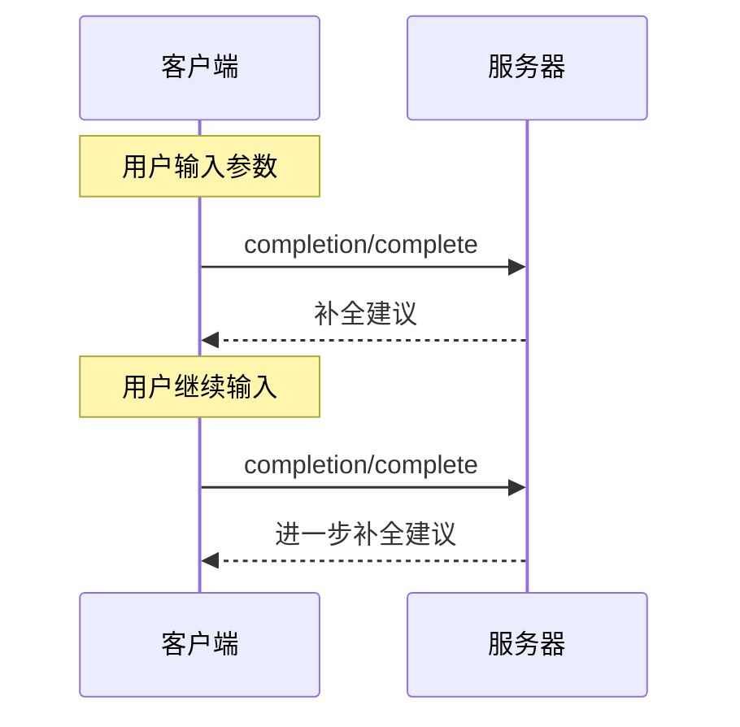

> **协议修订日期**: 2025-03-26

Model Context Protocol（MCP）提供了一种标准化的方法，服务器可以通过它为提示和资源 URI 提供参数自动补全建议。这使用户在输入参数值时能够获得丰富的类似于 IDE 的上下文建议体验。

## 用户交互模型

MCP 中的自动补全旨在支持类似于 IDE 代码补全的交互式用户体验。

例如，应用可以在用户输入时通过下拉或弹出菜单显示补全建议，并能够根据可用选项进行筛选和选择。

然而，协议本身并不强制规定特定的用户交互模型，具体实现可以自由选择任何适合其需求的界面模式。

## 功能声明

支持 Completion 的服务器**必须**声明 `completions` 功能：

```json
{
  "capabilities": {
    "completions": {}
  }
}
```

## 协议消息

### 请求补全

为了获取补全建议，客户端通过 `completion/complete` 请求指定需要补全的内容引用类型：

**请求:**

```json
{
  "jsonrpc": "2.0",
  "id": 1,
  "method": "completion/complete",
  "params": {
    "ref": {
      "type": "ref/prompt",
      "name": "code_review"
    },
    "argument": {
      "name": "language",
      "value": "py"
    }
  }
}
```

**响应:**

```json
{
  "jsonrpc": "2.0",
  "id": 1,
  "result": {
    "completion": {
      "values": ["python", "pytorch", "pyside"],
      "total": 10,
      "hasMore": true
    }
  }
}
```

### 引用类型

该协议支持两种类型的补全引用：

| 类型            | 描述                         | 示例                                                |
| --------------- | ---------------------------- | --------------------------------------------------- |
| `ref/prompt`    | 按名称引用一个提示           | `{"type": "ref/prompt", "name": "code_review"}`     |
| `ref/resource`  | 按 URI 引用一个资源          | `{"type": "ref/resource", "uri": "file:///{path}"}` |

### 补全结果

服务器需返回按相关性排序的补全值数组，其中包括：

- 每次响应最多 100 项
- 可选的总匹配项数
- 是否有其他结果的布尔值

## 消息流程



## 数据类型

### CompleteRequest

- `ref`: 一个 `PromptReference` 或 `ResourceReference`
- `argument`: 包含以下内容的对象：
  - `name`: 参数名称
  - `value`: 当前值

### CompleteResult

- `completion`: 包含以下内容的对象：
  - `values`: 建议的数组（最多 100 项）
  - `total`: 可选的总匹配项数
  - `hasMore`: 其他结果标记

## 错误处理

服务器 **应该** 在常见失败情况下返回标准的 JSON-RPC 错误：

- 方法未找到: `-32601` (不支持的功能)
- 无效的提示名称: `-32602` (参数无效)
- 缺少必要参数: `-32602` (参数无效)
- 内部错误: `-32603` (内部错误)

## 实现注意事项

1. 服务器 **应该**：

   - 返回按相关性排序的建议
   - 在适用场景下实施模糊匹配
   - 对补全请求进行速率限制
   - 验证所有输入

2. 客户端 **应该**：
   - 对快速补全请求进行去抖处理
   - 在适当情况下对补全结果进行缓存
   - 优雅地处理缺失或部分结果

## 安全性

实现**必须**：

- 验证所有补全输入
- 实施适当的速率限制
- 控制对敏感建议的访问
- 防止基于补全的敏感信息泄露
