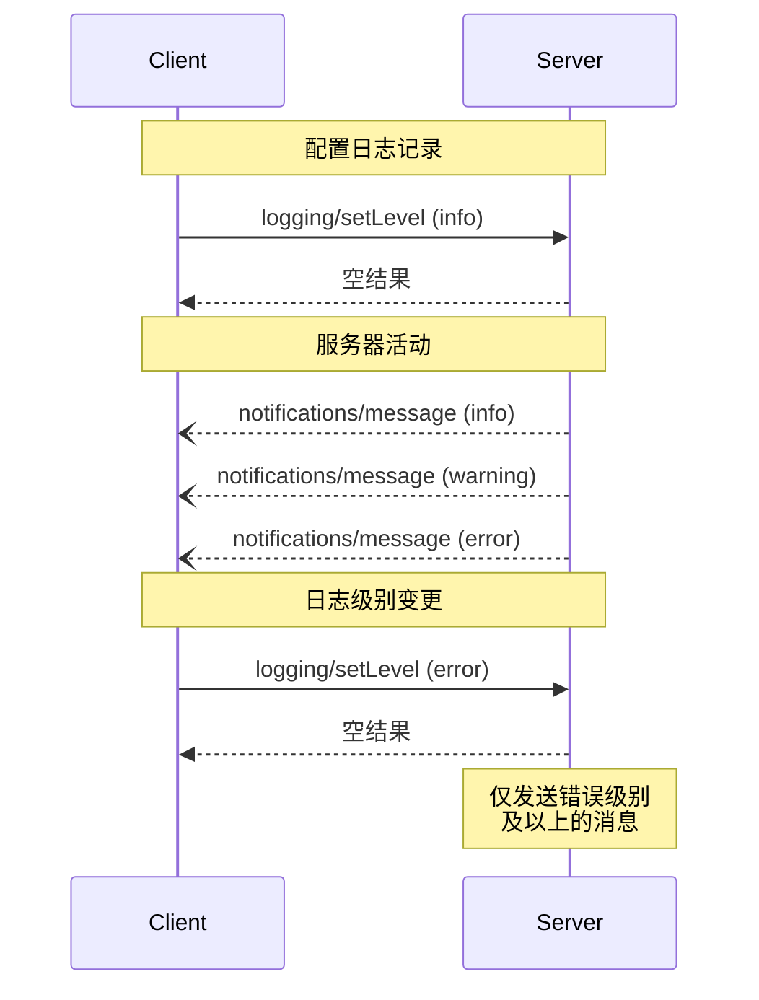

> **协议修订**: 2025-03-26

模型上下文协议 (MCP) 提供了一种标准化方式，使服务器能够向客户端发送结构化日志消息。客户端可以通过设置最小日志级别来控制日志的详细程度，服务器则发送通知包括严重性级别，可选的日志器名称，以及任意可序列化为 JSON 的数据。

## 用户交互模型

实现可以通过任何符合自身需求的接口模式来暴露日志功能&mdash;协议本身并未要求特定的用户交互模型。

## 功能

发送日志消息通知的服务器 **必须** 声明 `logging` 功能：

```json
{
  "capabilities": {
    "logging": {}
  }
}
```

## 日志级别

协议遵循 [RFC 5424](https://datatracker.ietf.org/doc/html/rfc5424#section-6.2.1) 中定义的标准 Syslog 严重性级别：

| 级别       | 描述                         | 示例用例                   |
| ---------- | ---------------------------- | -------------------------- |
| debug      | 详细的调试信息               | 函数入口/退出点            |
| info       | 一般信息性消息               | 操作进程更新               |
| notice     | 正常但重要的事件             | 配置变更                   |
| warning    | 警告条件                     | 使用已弃用的功能           |
| error      | 错误条件                     | 操作失败                   |
| critical   | 严重条件                     | 系统组件故障               |
| alert      | 需要立即采取行动             | 数据损坏被检测到           |
| emergency  | 系统不可用                   | 整个系统故障               |

## 协议消息

### 设置日志级别

为了配置最小日志级别，客户端 **可以** 发送 `logging/setLevel` 请求：

**请求:**

```json
{
  "jsonrpc": "2.0",
  "id": 1,
  "method": "logging/setLevel",
  "params": {
    "level": "info"
  }
}
```

### 日志消息通知

服务器通过 `notifications/message` 通知发送日志消息：

```json
{
  "jsonrpc": "2.0",
  "method": "notifications/message",
  "params": {
    "level": "error",
    "logger": "database",
    "data": {
      "error": "Connection failed",
      "details": {
        "host": "localhost",
        "port": 5432
      }
    }
  }
}
```

## 消息流



## 错误处理

对于常见的失败情况，服务器 **应该** 返回标准 JSON-RPC 错误：

- 无效的日志级别: `-32602` (参数无效)
- 配置错误: `-32603` (内部错误)

## 实现注意事项

1. 服务器**应该**：

   - 对日志消息进行速率限制
   - 在 `data` 字段中包含相关上下文信息
   - 使用统一的日志器名称
   - 移除敏感信息

2. 客户端**可以**：
   - 在界面中显示日志消息
   - 实现日志过滤/搜索
   - 视觉上展示严重性级别
   - 持久化存储日志消息

## 安全性

1. 日志消息**不得**包含：

   - 凭证或密钥
   - 个人身份信息
   - 内部系统细节以防助长攻击

2. 实现**应该**：
   - 对消息进行速率限制
   - 验证所有数据字段
   - 控制日志访问权限
   - 监控敏感内容

