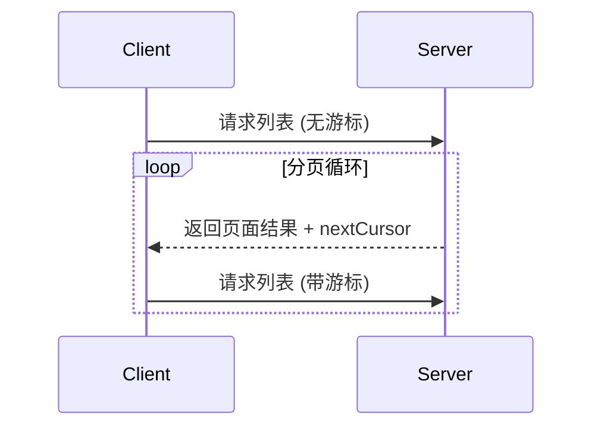

> **协议修订日期**: 2025-03-26

Model Context Protocol (MCP) 支持分页列表操作，这些操作可能返回大量结果集。分页允许服务器将结果以较小的块返回，而不是一次性返回全部结果。

分页在通过互联网连接到外部服务时特别重要，同时在本地集成中，分页也可以避免处理大型数据集时的性能问题。

## 分页模型

MCP 中的分页使用了基于不透明游标的方式，而不是使用页码。

- **游标** 是表示结果集中的某个位置的不透明字符串
- **页面大小** 由服务器决定，并且 **可能不会** 固定

## 响应格式

分页从服务器发送包含以下信息的 **响应** 开始：

- 当前页面的结果
- 如果存在更多结果，则提供一个可选的 `nextCursor` 字段

```json
{
  "jsonrpc": "2.0",
  "id": "123",
  "result": {
    "resources": [...],
    "nextCursor": "eyJwYWdlIjogM30="
  }
}
```

## 请求格式

在接收到游标后，客户端可以通过包含该游标的请求继续分页：

```json
{
  "jsonrpc": "2.0",
  "method": "resources/list",
  "params": {
    "cursor": "eyJwYWdlIjogMn0="
  }
}
```

## 分页流程



## 支持分页的操作

以下 MCP 操作支持分页：

- `resources/list` - 列出可用资源
- `resources/templates/list` - 列出资源模板
- `prompts/list` - 列出可用的提示
- `tools/list` - 列出可用的工具

## 实现指南

1. 服务器 **应该**：

   - 提供稳定的游标
   - 优雅地处理无效游标

2. 客户端 **应该**：

   - 将缺失的 `nextCursor` 视为结果的结束
   - 支持分页和非分页流程

3. 客户端 **必须** 将游标视为不透明令牌：
   - 不要对游标格式作出假设
   - 不要试图解析或修改游标
   - 不要跨会话持久化游标

## 错误处理

对于无效游标，**应该** 返回一个错误，代码为 -32602 (Invalid params)。
